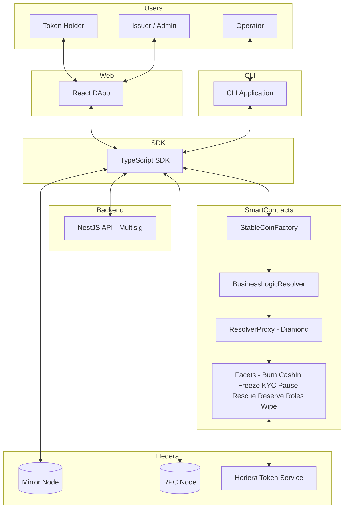

<div align="center">

# Stablecoin Studio

[](LICENSE)

</div>

## Introduction

**Stablecoin Studio** is an institutional-grade framework to issue and manage stablecoins on the **Hedera network**. It leverages the **Hedera Token Service (HTS)** for speed and **Smart Contracts** for programmable compliance.

The toolkit provides everything needed to create, configure, and operate stablecoins with enterprise-level features including multi-role access control, KYC/AML compliance, proof of reserve integration, and multisignature transaction support.

This monorepo is structured with **npm workspaces** and is designed for scalability, modularity, and enterprise adoption.

---

## Key Features

- **Stablecoin Management**
  - Stablecoins as **decorator tokens** on top of standard Hedera Tokens.
  - **Diamond proxy pattern** with centralized resolver for upgradeable smart contracts.
  - Fine-grained **Role-Based Access Control** (Admin, Cash-in, Burn, Wipe, Pause, Freeze, KYC, Rescue, Delete).
  - Split supply roles with cash-in/burn separation and configurable supply allowances.

- **Compliance & Security**
  - Native **KYC/AML** support with per-account verification.
  - Account **freezing** and **wiping** for regulatory compliance.
  - **Proof of Reserve** integration via Chainlink AggregatorV3Interface.
  - Rescue capabilities for asset recovery.

- **Multisignature Support**
  - Backend API for managing multisig transaction workflows.
  - Support for Hedera `keyList` and `thresholdKey` accounts.
  - Temporary transaction storage with signature collection.

- **Enterprise Development Practices**
  - **Domain-Driven Design (DDD)** and **Hexagonal Architecture**.
  - **Command Query Separation (CQS)** pattern in the SDK.
  - Dependency injection with tsyringe.
  - Wallet adapter support (HashPack, MetaMask, Blade, Custodial).

## Monorepo Structure

```
├── contracts/              # Solidity smart contracts (Hardhat)
│   ├── contracts/
│   │   ├── extensions/     # Facets (Burn, CashIn, Freeze, KYC, Pause, Rescue, Reserve, Roles, Wipe, Hold)
│   │   ├── resolver/       # BusinessLogicResolver and ResolverProxy
│   │   └── Interfaces/     # Contract interfaces
│   └── test/
├── sdk/                    # TypeScript SDK (Hexagonal Architecture + DDD + CQS)
│   └── src/
│       ├── domain/         # Domain entities and business logic
│       ├── app/            # Application layer (commands, queries, handlers)
│       ├── port/           # Inbound/outbound ports
│       └── core/           # Infrastructure and cross-cutting concerns
├── backend/                # NestJS REST API for multisignature transactions
├── cli/                    # Command-line interface for stablecoin operations
├── web/                    # React DApp for stablecoin management
├── docs/                   # Documentation site (Docusaurus)
├── documentation/          # Technical documentation content
│   ├── gettingStarted/     # Setup and onboarding guides
│   ├── sdk/                # SDK documentation
│   ├── backend/            # Backend documentation
│   ├── client/             # CLI documentation
│   └── web/                # Web DApp documentation
└── package.json            # Workspace configuration and root scripts
```

## Documentation

**Complete documentation:** [documentation/intro.md](documentation/intro.md)

This project follows a **"Docs-as-Code"** philosophy with comprehensive documentation maintained alongside the source code.

You can also run the documentation site locally:

```bash
npm run docs
```

## Architecture

### High-Level Overview



## Installation & Setup

### Prerequisites

- **Node.js**: v18.16.0 or higher (LTS recommended)
- **npm**: v10 or higher

### Quick Setup

From the monorepo root:

```bash
npm run setup
```

This command installs all dependencies and builds all modules in the correct order (contracts → SDK → CLI, Web, Backend).

### Selective Setup

You can install and build specific modules:

```bash
# Install specific module dependencies
npm run install:contracts
npm run install:sdk
npm run install:cli
npm run install:web
npm run install:backend
npm run install:docs
```

### Build Order

Modules have dependencies on each other. Build order matters:

1. **Contracts** must be built first (compiles Solidity, generates ABIs)
2. **SDK** depends on contracts
3. **CLI** and **Web** depend on SDK
4. **Backend** can be built independently

```bash
npm run build:contracts    # 1st
npm run build:sdk          # 2nd
npm run build:cli          # 3rd
npm run build:web          # or 3rd
npm run build:backend      # Independent
```

### Environment Configuration

Each module has its own `.env` configuration. Sample files are provided:

- **Contracts**: `contracts/.env` (test account credentials) — use `contracts/.env.sample`
- **CLI**: `cli/hsca-config.yaml` — use `cli/hsca-config.sample.yaml`
- **Web**: `web/.env` (factory addresses, mirror node, RPC endpoints)
- **Backend**: `backend/.env` (database, port configuration)

## Development Workflows

### Smart Contracts

```bash
cd contracts
npm run compile            # Compile changed contracts
npm run compile:force      # Force recompile all
npm test                   # Run all tests
npm run test:parallel      # Run tests in parallel
```

### SDK

```bash
cd sdk
npm run build              # Build SDK
npm test                   # Run tests
npm run test:watch         # Watch mode
```

### CLI

```bash
cd cli
npm run build              # Build CLI
npm start                  # Start CLI
npm run start:wizard       # Start in wizard mode
```

### Web DApp

```bash
cd web
npm run build              # Build web app
npm start                  # Start dev server on http://localhost:3000
```

### Backend

```bash
cd backend
npm run build              # Build backend
npm run start:dev          # Development mode with watch
npm run start:debug        # Debug mode
npm test                   # Unit tests
npm run test:e2e           # End-to-end tests
```

## Testing

Run tests for individual modules:

```bash
npm test --workspace=contracts     # Smart contract tests
npm test --workspace=sdk           # SDK tests
npm test --workspace=backend       # Backend unit tests
```

### Code Quality Standards

- **SDK / CLI / Web**: >70% code coverage
- **Smart Contracts**: 100% coverage of public/external methods
- All code must pass prettier and linting checks

```bash
npm run prettier           # Format all modules
npm run prettier:check     # Check formatting without changes
```

## Continuous Integration

The project uses separate GitHub Actions workflows for each module:

- **Contracts Tests** (`.github/workflows/test-contracts.yaml`): Runs when contract files change
- **SDK Tests** (`.github/workflows/test-sdk.yaml`): Runs when SDK files change
- **Backend Tests** (`.github/workflows/test-backend.yaml`): Runs when backend files change
- **CLI Tests** (`.github/workflows/test-cli.yaml`): Runs when CLI files change
- **Web Tests** (`.github/workflows/test-web.yaml`): Runs when web files change
- **Publish** (`.github/workflows/publish.yaml`): Package publishing workflow
- **Version** (`.github/workflows/version.yaml`): Version management workflow

## Support

If you have a question on how to use the product, please see our
[support guide](https://github.com/hashgraph/.github/blob/main/SUPPORT.md).

## Contributing

Contributions are welcome. Please see the
[contributing guide](https://github.com/hashgraph/.github/blob/main/CONTRIBUTING.md)
to see how you can get involved.

## Code of Conduct

This project is governed by the
[Contributor Covenant Code of Conduct](https://github.com/hashgraph/.github/blob/main/CODE_OF_CONDUCT.md). By
participating, you are expected to uphold this code of conduct. Please report unacceptable behavior
to [oss@hedera.com](mailto:oss@hedera.com).

## License

[Apache License 2.0](LICENSE)

## Security

Please do not file a public ticket mentioning the vulnerability. Refer to the security policy defined in the [SECURITY.md](SECURITY.md).
