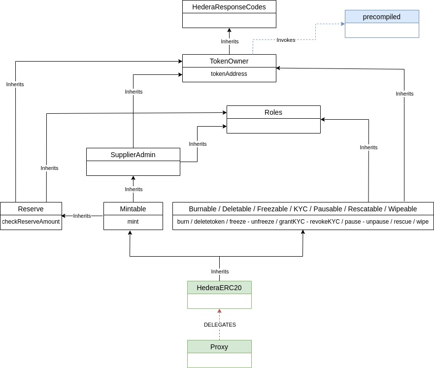

# Hedera Stable Coin Smart Contracts

### Table of Contents

-   **[Overview](#Overview)**<br>
-   **[Architecture](#Architecture)**<br>
    -   [Overall architecture](#Overall-Architecture)<br>
    -   [Detailed architecture](#Detailed-Architecture)<br>
-   **[Content](#Content)**<br>
-   **[Technologies](#Technologies)**<br>
-   **[Build](#Build)**<br>
-   **[Test](#Test)**<br>
    -   [Files](#Files)<br>
    -   [Configuration](#Configuration)<br>
    -   [Run](#Run)<br>
-   **[Deploy](#Deploy)**<br>
    -   [Deploy factory](#Deploy-Factory)<br>
    -   [Create stable coins](#Create-Stable-Coins)<br>
-   **[Upgrade](#Upgrade)**<br>
    -   [Upgrade factory](#Upgrade-Factory)<br>
    -   [Upgrade stable coins](#Upgrade-Stable-Coins)<br>
-   **[Generate documentation](#Generate-Documentation)**<br>
-   **[Other scripts](#Other-Scripts)**<br>
-   **[Contributing](#Contributing)**<br>
-   **[Code of conduct](#Code-of-Conduct)**<br>
-   **[License](#License)**<br>


# Overview

This module contains the solidity smart contracts used in the Hedera stable coin project.

The Hedera Token Service (HTS) functionality required in this project is exposed through an `HTS precompiled smart contract` implemented, deployed and managed by Hedera.

The smart contracts located in the `hts-precompile` folder are used to interact with the _HTS precompiled smart contract_ mentioned above, and have also been implemented and provided by Hedera. For more information about these contracts check the [Hedera Service Solidity Library](https://docs.hedera.com/guides/docs/sdks/smart-contracts/hedera-service-solidity-libraries) and the [Hedera hts precompiled contracts gitHub repository](https://github.com/hashgraph/hedera-smart-contracts/tree/main/contracts/hts-precompile):

-   `HederaRespondeCodes.sol`: Contains the list of response codes the _HTS precompiled smart contract_ methods return.
-   `IHederaTokenService.sol`: Interface implemented by the _HTS precompiled smart contract_. In order to execute an HTS operation, our smart contracts will need to instantiate this interface with the _HTS precompiled smart contract_ address.

The remaining smart contracts have been implemented for this project:

 - Contracts within the `extensions` folder: *one contract for each stable coin operation*.
   - `Burnable.sol`: abstract contract implementing the *burn* operation (burns tokens from the treasury account. Decreases the total supply).
   - `CashIn.sol`: abstract contract implementing the *cash-in* operation (mints new tokens and transfers them to an account. Increases the total supply).
   - `Deletable.sol`: abstract contract implementing the *delete* operation (deletes the stable coin's underlying token. **WARNING** : THIS OPERATION CANNOT BE ROLLED-BACK AND A STABLE COIN WITHOUT AN UNDERLYING TOKEN WILL NOT WORK ANYMORE).
   - `Freezable.sol`: abstract contract implementing the *freeze* and *unfreeze* operations (if the token is fronzen for an account, this account will not be able to operate with the stable coin until unfrozen).
   - `KYC.sol`: abstract contract implementing the *grantKyc* and *revokeKyc* operations to grant or revoke KYC flag to a Hedera account for the stable coin.
   - `Pausable.sol`: abstract contract implementing the *pause* and *unpause* operations (if a token is paused, nobody will be able to operate with it until the token is unpaused).  
   - `Rescatable.sol`: abstract contract implementing the *rescue* and *rescueHBAR* operation (transfers tokens and HBAR, respectively, from the treasury account being the stable coin's smart contract to another account).
   - `Reserve.sol`: abstract contract implementing the reserve for the stable coin (checking against the current reserve before minting, changing the reserve data feed, etc...).
   - `RoleManagement.sol`: abstract contract implementing the *grantRoles* and *revokeRoles* operations (granting and revoking multiple roles to/from multiple accounts in one single transaction).
   - `Roles.sol`: contains the definition of the roles that can be assigned for every stable coin.
   - `Supplieradmin.sol`: abstract contract implementing all the *cash-in* role assignment and management (assigning/removing the role as well as setting, increasing and decreasing the cash-in limit).
   - `TokenOwner.sol`: abstract contract that stores the addresses of the *HTS precompiled smart contract* and the *underlying token* related to the stable coin. All the smart contracts mentioned above, inherit from this abstract contract.
   - `Wipeable.sol`: abstract contract implementing the *wipe* operation (burn token from any account. Decreases the total supply).
- Contracts within the `proxies` folder:
  - `StableCoinProxyAdmin.sol`: This contract implements the OpenZeppelin's `transparent ProxyAdmin` but also inherits from the OpenZeppelin's `Ownable2Step` to prevent the ownership to be accidentally transferred.     
 - `HederaReserve.sol`: implements the ChainLink AggregatorV3Interface to provide the current data about the stable coin's reserve.
 - `HederaTokenManager.sol`: main stable coin contract. Contains all the stable coin related logic. Inherits all the contracts defined in the "extension" folder as well as the Role.sol contract. **IMPORTANT** : a HederaTokenManager contract will be deployed in testnet for anybody to use. Users are also free to deploy and use their own HederaTokenManager contract. Whatever HederaTokenManager contract users choose to use, they will need to pass the contract's address as an input argument when calling the factory.
 - `StableCoinFactory.sol`: implements the flow to create a new stable coin. Every time a new stable coin is created, several smart contracts must be deployed and initialized and an underlying token must be created through the `HTS precompiled smart contract`. this multi-transaction process is encapsulated in this contract so that users can create new stable coins in a single transaction. **IMPORTANT** : a factory contract will be deployed in tesnet for anybody to use. Users are also free to deploy and use their own factory contract.
 - These last three contracts have their own interfaces in the `Interfaces` folder.

 > Every stable coin is made of a **ProxyAdmin** and a **TransparentUpgradeableProxy** contracts (from OpenZeppelin) plus an **underlying token** managed through the *HTS precompiled smart contract*. The **hederaTokenManager** contract is meant to be "shared" by multiple users (using proxies). A stable coin admin may also choose to deploy a **HederaReserve** along with the stable coin at creation time, with its own **TransparentUpgradeableProxy** and **ProxyAdmin** contracts, or to define an existing reserve instead.

# Architecture

## Overall Architecture


## Detailed Architecture



# Content

These are the folders and files you can find in this project:

 - `contracts`: The folder with the solidity files. Inside this folder you can also find the *hts-precompile* and the *extensions* folders, including this last one an interface folder, presented in the **[Overview](#Overview)** section.
 - `docs`: Detailed documentation for each smart contract in the "contracts" folder.
 - `scripts`: Typescript files used to create new stable coins and deploy required smart contracts. These files are used when testing.
 - `test`: Typescript tests files.
 - `typechain-types`: the most important thing in this folder are contract factories which are used not only for testing, but also by any other project importing the stable coin solution. The content of this folder is autogenerated by `hardhat-abi-exporter` plugin whenever the user compiles the contracts.
 - `.env`: environment file used in tests execution.
 - `.eslintrc.json`: ESLint tool configuration file for linting JavaScript code. 
 - `.solhint.json`: Solhint tool configuration file for linting solidity code.
 - `hardhat.config.ts`: hardhat configuration file.
 - `package.json`: Node project configuration file.
 - `prettier.config.js`: several languages code formatter configuration file.
 - `README.md`
 - `Slither`: folder containing everything related to the slither analysis.
 - `tsconfig.json`: TypeScript configuration file.
 - `tslint.json`: TSLint tool configuration file for linting TypeScript code.

# Technologies

The IDE we use in this project is **Hardhat**, in order to use it you must have:

-   [Hardhat](https://hardhat.org/docs)
-   [node (version 16)](https://nodejs.org/en/about/)
-   [npm](https://www.npmjs.com/)

The smart contract programming language is **Solidity** version 0.8.16.


# Build

First download and install the project dependencies :

1. Run `cd contracts`. This will change your current working directory to the `contracts` folder.
2. Run `npm install`. This will create and populate `node_modules`.

Then compile and build the contracts, you can choose one of the following options:

1. Run `npm run compile` to compile the contracts that were modified after the last compilation (This will NOT build the package, you need to run step 3)
2. Run `npm run compile:force` to compile all the contracts (even those that were not modified after the last compilation) and build the package (you can skip step 3).
3. run `npm run build` to build the package without compiling the contracts.

The first two commands will generate a `build` folder that contains a `typechain-types` folder. This folder contains the contracts wrappers that allows us to access contracts abi importing the wrappers as shown below:

```code
import { hederaTokenManager__factory } from '@hashgraph-dev/stablecoin-npm-contracts/typechain-types';
```

# Test

Each test has been designed to be self-contained following the _arrange, act, assert_ pattern. Tests are completely independent of each other and as such should successfully run in any order.

## Files

Typescript test files can be found in the `test` folder:

- `burnable.ts`: tests the stable coin burn functionality.
- `deletable.ts`: tests the stable coin delete functionality.
- `deployFactory.ts`: tests the stable coin factory deployment functionality.
- `freezable.ts`: tests the stable coin freeze/unfreeze functionality.
- `hederaReserve.ts`: tests the HederaReserve functionality.
- `hederaTokenManager.ts`: tests the hederaTokenManager functionality.
- `kyc.ts`: tests the KYC grant/revoke functionality to account for stable coins.
- `pausable.ts`: tests the stable coin pause functionality.
- `rescatable.ts`: tests the stable coin rescue functionality.
- `reserve.ts`: tests the stable coin reserve functionality.
- `roleManagement.ts`: tests the stable coin roles (granting/revoking multiple roles) functionality.
- `roles.ts`: tests the stable coin roles functionality.
- `stableCoinFactory.ts`: tests the Factory functionality.
- `supplieradmin.ts`: tests the stable coin cash-in functionality.
- `wipeable.ts`: tests the stable coin wipe functionality.


## Configuration
### Test accounts
You need to create the `.env` file cloning the content of `.env.sample` and add **two Hedera accounts** that will be used for testing.

These accounts must be existing valid accounts in the **Hedera network** you are using to test the smart contracts, they must also have a **positive balance large enough** to run all the contract deployments, invocations and token creations executed in the tests.

Accounts must be defined in this section:

> hedera -> networks -> **[network in which you want to run the tests]** -> accounts

For each account you must provide the following information:

-   **account**: Account ID (0.0.XXXXXX)
-   **private Key**: Private Key associated to the account (7647657eerr65....878)
-   **public Key**: Public Key linked to the private key (c14er56...78)
-   **isED25519Type**: _true/false_ indicate whether the private/public key is ED25519 (true) or ECSDA (false)

Example for the Hedera testnet (_these are fake accounts/keys_):

```.env
    HEDERA_OPERATOR_ACCOUNT='0.0.48513676'
    HEDERA_OPERATOR_PUBLICKEY='c14dbe4c936181b7a2fe7faf086fd95bdc6900e2d16533e3e8ffd00cac1fe607'
    HEDERA_OPERATOR_PRIVATEKEY='8830990f02fae1c3a843b8aaad0433a73ee47b08d56426a8e416d08727ea0609'
    HEDERA_OPERATOR_ED25519=true

    HEDERA_NON_OPERATOR_ACCOUNT='0.0.47786654'
    HEDERA_NON_OPERATOR_PUBLICKEY='302a300506032b657003210057056288u5d5a9cdaeb85687391dc7372707c464f9e7cb0efb386cf4244ebdf6'
    HEDERA_NON_OPERATOR_PRIVATEKEY='302e020100300506032b6baf04220420b7ca8f1a5453d5c03b0d8ba99d06306ed6c93ee64d7bf122c21b0981e2b0b679'
    HEDERA_NON_OPERATOR_ED25519=true
```
### Operating accounts
All tests will use the two above mentioned accounts.
- `Operator Account`: This is the account that will deploy the stable coin used for testing. It will have full rights.
- `Non Operator Account`: This is the account that will NOT deploy the stable coin used for testing. It will have no rights to the stable coin unless explicitly granted during the test.

You can change which account is the *operator* and the *non-operator* account by changing the **clientId** value at: 
scripts -> utils.ts -> const clientId

### Pre-deployed Factory & hederaTokenManager contracts
Tests use a factory and a HederaTokenManager contract to create the stable coins.
- If you want to deploy a new factory and HederaTokenManager every time: scripts -> deploy.ts -> hederaTokenManagerAddress = "" / factoryProxyAddress = "" / factoryProxyAdminAddress = "" / factoryAddress = "" 
- If you want to re-use a factory and hederaTokenManager : Set the Hedera ContractIds in scripts -> deploy.ts -> hederaTokenManagerAddress /factoryProxyAddress / factoryProxyAdminAddress / factoryAddress

> If you set the factory contracts addresses as described above, the tests included in the "stableCoinFactory.ts" file might not work because they will try to upgrade the factory implementation and the accounts used for that (those defined in the "hardhat.config.ts") might not have the right to do it.

## Run

There are several ways to run the tests using the commands defined in the `package.json` file (according to the configuration defined in `hardhat.config.ts`):

-   Run all the test files in the `defaultNetwork` network:

```shell
npm test
```

-   Run all the test files in a specific network (Hedera TestNet):

```shell
npm test:testnet
```

-   Run a single test file in the `defaultNetwork` network:

```shell
npm test:mintable
```

-   Run a single test file in a specific network (Hedera PreviewNet):

```shell
npm test:previewnet:mintable
```

# Deploy
The stable coin solution is made of two major components. 
- **The factory** : Smart contracts encapsulating the complexity of the creation of new stable coins.
- **The stable coin** : Smart contracts that are deployed by the factory, exposing the functionalities and services of the stable coin solution and interacting with an underlying token.

In order to create stable coins, a Factory and a hederaTokenManager contracts must be deployed first. Once deployed, creating stable coins will be as simple as invoking the "deployStableCoin" method of the Factory passing the token basic information and the hederaTokenManager contract address as input arguments.

> A factory and hederaTokenManager contracts will be provided for everybody to use in the testnet network. The address of the factory proxy is configured both in the CLI configuration file and in the web environment file. On the contrary, hederaTokenManager implementations depends on the factory, so the factory smart contract has functions to manage hederaTokenmanager smart contracts versions.

## Deploy Factory
If you want to deploy your own Factory contracts do the following steps:
   1. Deploy the Factory **Logic** smart contract (*StableCoinFactory.sol*).
   2. Deploy the Factory **Proxy Admin** smart contract.
   3. Deploy the Factory **TransparentUpgradeableProxy** smart contract setting the Factory logic as the implementation and the Factory proxy admin as the admin.

You may also clone this repository, install the dependencies (see [Build](#Build)) and run `npx hardhat deployFactory` in order to deploy all factories (hederaTokenManager and stableCoinFactory) and its proxies onto the testnet network. Once completed, an output with the new addresses is provided:

`````
Proxy Address:           0.0.7110 
Proxy Admin Address:     0.0.7108 
Factory Address:         0.0.7106 
hederaTokenManager Address:     0.0.7102
`````

> The account used to deploy will be determined by the values in the `.env` file, that must contain the `HEDERA_OPERATOR_` entries for the account id, public / private key and evm address. See the `.env.sample` file to see all the attributes. See [Test accounts](#Test-accounts) to learn more.


## Create Stable Coins
Once the factory has been deployed (or if you are using the common factory), creating stable coins is very simple, just invoke one single method of the Factory's Logic (through the Factory's Proxy): `deployStableCoin(...)`
> it can be easily done from the CLI and/or UI of the project, for more information on that check their respective README.md

These are the steps the creation method will perform when creating a new stable coin:
- Deploy **stable coin proxy admin smart contract** (from the Open Zeppelin library).
- Transfer the Stable Coin Proxy Admin ownership to the sender account.
- Deploy **stable coin proxy smart contract** (from the Open Zeppelin library) setting the implementation contract (*the hederaTokenManager contract's address you provided as an input argument) and the admin (*stable coin proxy admin smart contract*).
- Initializing the stable coin proxy. The initialization will create the underlying token.
- Associating the token to the deploying account.
- Granting the KYC to the account for the token, only if the user configured a KYC key in the token when created.

# Upgrade

In order to make all our smart contract's implementation upgradable, we are using the _Transparent Proxy_ pattern combined with the _Proxy admin_ pattern, both from OpenZeppelin. You can find more information about these two patterns [here](https://docs.openzeppelin.com/contracts/4.x/api/proxy#transparent_proxy).

It is also important to note that, in order to avoid future overlapping of state variable due to the inheritance process, we use the _storage gap_ strategy from OpenZeppelin, you can find more information about this strategy [here](https://docs.openzeppelin.com/contracts/3.x/upgradeable#storage_gaps).

The factory's and the stable coins's logic can be upgraded at any time using the account that was used to either deploy it the first time (for the factory) or create it (for the stable coins).

## Upgrade Factory

-   Deploy the new factory logic contract.
-   Invoke the `upgradeAndCall` method of the factory proxy admin passing the previously deployed factory logic contract's address and any data required to initialize it. If you do not need to pass any initialization data, you can simply invoke the `upgrade` method passing the previously deployed factory logic contract's address. **=> USE THE FACTORY PROXY'S ADMIN OWNER ACCOUNT TO PERFORM THIS TASK. BY DEFAULT THAT ACCOUNT WILL BE THE ONE ORIGINALLY USED TO DEPLOY THE FACTORY.**

## Upgrade Stable Coins

> These steps must be performed individually for every single stable coin you wish to upgrade. It is not possible to upgrade all stable coins at once since they are completely independent of each other:

-   Deploy the new stable coin logic contract (*hederaTokenManager*).
-   Invoke the `upgradeAndCall` method of the stable coin proxy admin passing the previously deployed stable coin logic contract's address and any data required to initialize it. If you do not need to pass any initialization data, you can simply invoke the `upgrade` method passing the previously deployed stable coin logic contract's address. **=> USE THE STABLE COIN PROXY'S ADMIN ACCOUNT TO PERFORM THIS TASK. BY DEFAULT THAT ACCOUNT WILL BE THE ONE ORIGINALLY USED TO CREATE THE STABLE COIN.**

# Change ProxyAdmin Owner

The _Transparent Proxy admin_ also allows to change the owner who can manage the proxy, like upgrading it, as explained above.
Initially, the account deploying the factory contract and the account deploying the stable coin are the owners of the respective proxy admin contracts, but these accounts, as owners, can change the ownership of the proxy admin.

# Generate Documentation

Documentation files of all contracts, in Markdown format, can be generated using the following command:

```shell
npm run doc
```

Generated files will be stored in the `docs` folder.

# Manage factory
Some scripts have been developed to manage the stable coin factory.
- Add a new TokenManager address to stable coin factory:
```shell
npx hardhat addNewVersionTokenManager --tokenManager <HederaId> --proxyfactory <HederaId>
```
- Update an TokenManager address:
```shell
npx hardhat addNewVersionTokenManager --tokenManager <HederaId> --proxyfactory <HederaId> --index <number>
```
- Remove an TokenManager address:
```shell
npx hardhat addNewVersionTokenManager --proxyfactory <HederaId> --index <number>
```
- Get TokenManager address saved in factory:
```shell
npx hardhat getTokenManager --proxyfactory <HederaId>
```

- Deploy a new TokenManager implementation:
```shell
npx hardhat deployTokenManager
```


# Other Scripts

In addition to the compilation, build, test and documentation scripts we have already covered, there are other scripts configured in `package.json` file:

Checks the contracts size in KiB.

```shell
npm run size
```

Lints Solidity code.

```shell
npm run lint:sol
```

Lints TypeScript code.

```shell
npm run lint:ts
```

Lints Solidity and TypeScript code.

```shell
npm run lint
```

Formats TypeScript, JavaScript and Solidity files code.

```shell
npm run prettier
```

Executes prettier and lint commands.

```shell
npm run pre-commit
```

Launches slither security report.

```shell
npm run slither
```

# Contributing
Contributions are welcome. Please see the
[contributing guide](https://github.com/hashgraph/.github/blob/main/CONTRIBUTING.md)
to see how you can get involved.

# Code of Conduct
This project is governed by the
[Contributor Covenant Code of Conduct](https://github.com/hashgraph/.github/blob/main/CODE_OF_CONDUCT.md). By
participating, you are expected to uphold this code of conduct. Please report unacceptable behavior
to [oss@hedera.com](mailto:oss@hedera.com).

# License
[Apache License 2.0](../LICENSE.md)
