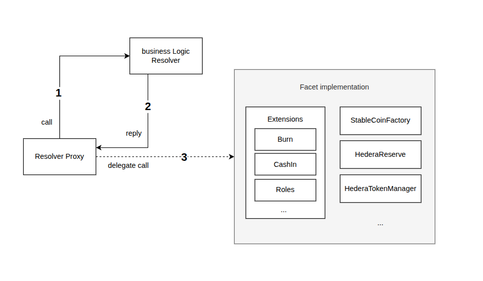

# Stablecoin Studio Smart Contracts

[](../LICENSE.md)

### Table of Contents

- **[Overview](#overview)**<br>
- **[Architecture](#architecture)**<br>
  - [Overall architecture](#overall-architecture)<br>
- **[Content](#content)**<br>
- **[Technologies](#technologies)**<br>
- **[Build](#build)**<br>
- **[Test](#test)**<br>
  - [Configuration](#configuration)<br>
    - [Test accounts](#test-accounts)<br>
    - [Operating accounts](#operating-accounts)<br>
  - [Run](#run-tests)<br>
    - [Run all tests (Default)](#run-all-test-default)<br>
    - [Run tests in parallel](#run-tests-in-parallel)<br>
    - [Run specific test](#run-specific-test)<br>
- **[Deploy](#deploy)**<br>
  - [Deploy full infrastructure](#deploy-full-infrastructure)<br>
    - [What Does This Do?](#what-does-this-do)<br>
    - [Optional flags](#optional-flags)<br>
  - [Deploy a new Stablecoin](#deploy-a-new-stablecoin)<br>
    - [Minimum required parameters](#minimun-required-parameters)<br>
    - [Example](#example)<br>
- **[Upgrade Logic](#upgrade-logic)**<br>
    - [How it works?](#how-it-works)<br>
    - [Register new logic version](#register-new-logic-version)<br>
    - [Required parameters](#required-parameters)<br>
    - [When to use this?](#when-to-use-this)<br>
- **[v1 to v2 Migration](#v1-to-v2-migration)**<br>
- **[v2 to v3 Migration](#v2-to-v3-migration)**<br>
- **[Generate documentation](#generate-documentation)**<br>
- **[Other scripts](#other-scripts)**<br>
- **[Contributing](#contributing)**<br>
- **[Code of conduct](#code-of-conduct)**<br>
- **[License](#license)**<br>


# Overview

This module contains the solidity smart contracts used in the Hedera stablecoin project.

The Hedera Token Service (HTS) functionality required in this project is exposed through an `HTS precompiled smart contract` implemented, deployed and managed by Hedera.

The smart contracts located in the `hts-precompile` folder are used to interact with the _HTS precompiled smart contract_ mentioned above, and have also been implemented and provided by Hedera. For more information about these contracts check the [Hedera Service Solidity Library](https://docs.hedera.com/guides/docs/sdks/smart-contracts/hedera-service-solidity-libraries) and the [Hedera hts precompiled contracts gitHub repository](https://github.com/hashgraph/hedera-smart-contracts/tree/main/contracts/hts-precompile):

- `HederaRespondeCodes.sol`: Contains the list of response codes the _HTS precompiled smart contract_ methods return.
- `IHederaTokenService.sol`: Interface implemented by the _HTS precompiled smart contract_. In order to execute an HTS operation, our smart contracts will need to instantiate this interface with the _HTS precompiled smart contract_ address.

The remaining smart contracts have been implemented for this project:
- Contracts within the `extensions` folder: _one contract for each stablecoin operation_.
  - `BurnableFacet.sol`: implements the _burn_ operation (burns tokens from the treasury account. Decreases the total supply).
  - `CashInFacet.sol`: implements the _cash-in_ operation (mints new tokens and transfers them to an account. Increases the total supply).
  - `DeletableFacet.sol`: implements the _delete_ operation (deletes the stablecoin's underlying token).  
    **WARNING**: THIS OPERATION CANNOT BE ROLLED BACK. A stablecoin WITHOUT AN UNDERLYING TOKEN WILL NOT WORK ANYMORE.
  - `FreezableFacet.sol`: implements the _freeze_ and _unfreeze_ operations (if the token is frozen for an account, this account will not be able to operate with the stablecoin until unfrozen).
  - `KYCFacet.sol`: implements the _grantKyc_ and _revokeKyc_ operations to grant or revoke the KYC flag to a Hedera account for the stablecoin.
  - `PausableFacet.sol`: implements the _pause_ and _unpause_ operations (if a token is paused, no one will be able to operate with it until unpaused).
  - `RescatableFacet.sol`: implements the _rescue_ and _rescueHBAR_ operations (transfers tokens and HBAR, respectively, from the treasury account—being the stablecoin’s smart contract—to another account).
  - `ReserveFacet.sol`: implements the reserve logic for the stablecoin (checks against the current reserve before minting, allows updating the reserve data feed, etc.).  
    The reserve address can be set to `0.0.0` (zero address) to disable the reserve mechanism.
  - `RoleManagementFacet.sol`: implements the _grantRoles_ and _revokeRoles_ operations (grants and revokes multiple roles to/from multiple accounts in a single transaction).
  - `RolesFacet.sol`: contains the definition of the roles that can be assigned to each stablecoin.
  - `SupplierAdminFacet.sol`: implements the management of the _cash-in_ role (assigning/removing the role and setting, increasing, or decreasing the cash-in limit).
  - `TokenOwnerFacet.sol`: stores the addresses of the _HTS precompiled smart contract_ and the _underlying token_ related to the stablecoin. All other facets rely on this.
  - `WipeableFacet.sol`: implements the _wipe_ operation (burns tokens from any account. Decreases the total supply).
  - `HoldManagementFacet.sol`: implements the _hold_ functionality, enabling temporary locking of tokens under the control of an escrow address. This is used in scenarios like secondary market trades or regulatory compliance.
- Important contracts within the `resolver` folder:
  - `BusinessLogicResolver.sol`: central contract that maps function selectors to facet addresses. All stablecoin proxies delegate the selector resolution to this resolver, enabling centralized upgradeability across all stablecoins.
  - `ResolverProxy.sol`: lightweight diamond clone that delegates execution to the correct facet based on the mapping returned by the `BusinessLogicResolver`.
  - `BusinessLogicResolverWrapper.sol`: helper contract to simplify interaction with the resolver.

- `HederaReserveFacet.sol`: implements the ChainLink AggregatorV3Interface to provide the current data about the stablecoin's reserve.
- `HederaTokenManagerFacet.sol`: defines the main logic to initialize and manage a stablecoin. It exposes key ERC-20-like read functions (`name`, `symbol`, `decimals`, `totalSupply`, `balanceOf`) and supports on-chain metadata and token updates via HTS.
- `StableCoinFactoryFacet.sol`: implements the flow to create a new stablecoin. Every time a new stablecoin is created, several smart contracts must be deployed and initialized and an underlying token must be created through the `HTS precompiled smart contract`. this multi-transaction process is encapsulated in this contract so that users can create new stablecoins in a single transaction. **IMPORTANT** : a factory contract will be deployed in tesnet for anybody to use. Users are also free to deploy and use their own factory contract.
- These last three contracts have their own interfaces in the `Interfaces` folder.

> 💡 Each stablecoin is deployed as a diamond clone (via `ResolverProxy`) and uses a shared `BusinessLogicResolver` to dynamically delegate logic calls. This enables centralized logic upgrades across all stablecoins with a single transaction.

# Architecture

## Overall architecture



# Content

These are the folders and files you can find in this project:

- `contracts`: The folder with the solidity files. Inside this folder you can also find the _hts-precompile_ and the _extensions_ folders, including this last one an interface folder, presented in the **[Overview](#Overview)** section.
- `docs`: Detailed documentation for each smart contract in the "contracts" folder.
- `scripts`: Typescript files used to create new stablecoins and deploy required smart contracts. These files are used when testing.
- `test`: Typescript tests files.
- `typechain-types`: the most important thing in this folder are contract factories which are used not only for testing, but also by any other project importing the stablecoin solution. The content of this folder is autogenerated by `hardhat-abi-exporter` plugin whenever the user compiles the contracts.
- `.env`: environment file used in tests execution.
- `.eslintrc.json`: ESLint tool configuration file for linting JavaScript code.
- `.solhint.json`: Solhint tool configuration file for linting solidity code.
- `hardhat.SignatureServiceConfig.ts`: hardhat configuration file.
- `package.json`: Node project configuration file.
- `prettier.config.js`: several languages code formatter configuration file.
- `README.md`
- `Slither`: folder containing everything related to the slither analysis.
- `tsconfig.json`: TypeScript configuration file.
- `tslint.json`: TSLint tool configuration file for linting TypeScript code.

# Technologies

The IDE we use in this project is **Hardhat**, in order to use it you must have:

- [Hardhat](https://hardhat.org/docs)
- [node (version 16)](https://nodejs.org/en/about/)
- [npm](https://www.npmjs.com/)

The smart contract programming language is **Solidity** version 0.8.16.

# Build

First download and install the project dependencies :

1. Run `cd contracts`. This will change your current working directory to the `contracts` folder.
2. Run `npm install`. This will create and populate `node_modules`.

Then compile and build the contracts, you can choose one of the following options:

1. Run `npm run compile` to compile the contracts that were modified after the last compilation (This will NOT build the package, you need to run step 3)
2. Run `npm run compile:force` to compile all the contracts (even those that were not modified after the last compilation) and build the package (you can skip step 3).
3. run `npm run build` to build the package without compiling the contracts.

The first two commands will generate a `build` folder that contains a `typechain-types` folder. This folder contains the contracts wrappers that allows us to access contracts abi importing the wrappers as shown below:

```code
import { hederaTokenManager__factory } from '@hashgraph/stablecoin-npm-contracts/typechain-types';
```

# Test

Each test follows the _arrange, act, assert_ pattern and is self-contained, ensuring full independence and allowing them to run in parallel and in any order.
Typescript test files are located in the `test` folder and are organized into two parallel execution threads:
- `Thread0/`
- `Thread1/`

## Configuration

### Test accounts

You need to create the `.env` file cloning the content of `.env.sample` and add **two Hedera accounts** that will be used for testing.

These accounts must be existing valid accounts in the **Hedera network** you are using to test the smart contracts, they must also have a **positive balance large enough** to run all the contract deployments, invocations and token creations executed in the tests.

For each account you must provide the Private Key (7647657eerr65....878)

Example for the Hedera testnet (_fake data_):

```.env
    # * Accounts and Keys
    # Private keys in RAW Format (Not DER)
    # local
    LOCAL_PRIVATE_KEY_0='0xEXAMPLEPRIVATEKEY0'
    LOCAL_PRIVATE_KEY_1='0xEXAMPLEPRIVATEKEY1'
    # testnet
    TESTNET_PRIVATE_KEY_0='0xEXAMPLEPRIVATEKEY4'
    TESTNET_PRIVATE_KEY_1='0xEXAMPLEPRIVATEKEY5'
    # ... add more keys as needed
    
```

#### Operating accounts

All tests will use the two above mentioned accounts.

- `Operator Account (PRIVATE_KEY_0)`: This is the account that will deploy the stablecoin used for testing. It will have full rights.
- `Non Operator Account (PRIVATE_KEY_1)`: This is the account that will NOT deploy the stablecoin used for testing. It will have no rights to the stablecoin unless explicitly granted during the test.


## Run tests
This project includes a suite of automated tests to validate stablecoin functionality. You can run all tests at once, in parallel, or focus on a specific test file.

### Run all test (Default):
Run all test files using the default configuration:
```bash
npm run test
```

### Run tests in parallel:
To speed up the process, you can run all tests concurrently:

```bash
npm run test:parallel
```
> Useful for CI environments or large test suites.

### Run specific test:
You can also run a single test file. For example, to run only the KYC-related tests:
```bash
npm run test:kyc
```
> You can customize this command or create more aliases in package.json as needed.

# Deploy 
## Deploy full infrastructure

To deploy the entire infrastructure required to support stablecoins, including all core facets, the factory, and the business logic resolver, use the provided programmatic setup via Hardhat.

This includes:

- All diamond facets (KYC, Hold, Burnable, CustomFees, etc.). 
- The BusinessLogicResolver, initialized and registered. 
- Creation of configurations (versioned logic definitions). 
- Deployment of a ResolverProxy for the StableCoinFactory.

```shell
npx hardhat deployAll --network <network>
```

### What Does This Do?
This deployment process:

1. **Deploys All Contracts**: Deploys all facets using their respective factories, such as `HederaTokenManagerFacet`, `ReserveFacet`, `KYCFacet`, `BurnableFacet`, `RolesFacet`, and more.
2. **Deploys & Initializes the BusinessLogicResolver**: The resolver is deployed and initialized to manage configuration keys and versioned logic.
3. **Registers Facets in the Resolver**: All deployed facets are registered under their appropriate configuration key (e.g., `stableCoin`, `reserve`, `factory`), including selectors and interface IDs.
4. **Creates Logic Configurations**: Each configuration (e.g., for stablecoin logic) is assigned a unique key and version, enabling future upgrades.
5. **Deploys ResolverProxy for Factory**: A `ResolverProxy` is deployed and linked to the `StableCoinFactory`, allowing it to dynamically use the registered logic.
6. **Displays All Deployed Contract Addresses**: Includes proxy addresses, base contract addresses, and Hedera IDs for convenient reference.

### Optional flags
| Flag                   | Description                                                                        |
| ---------------------- | ---------------------------------------------------------------------------------- |
| `--useDeployed`        | Reuse already deployed contracts if their addresses are known (default: `true`).   |
| `--privateKey`         | Use a raw private key as signer instead of local Hardhat account.                  |
| `--signerAddress`      | Specify signer by address from Hardhat signers array.                              |
| `--signerPosition`     | Specify signer by index in Hardhat signers array.                                  |


## Deploy a new Stablecoin
The deployment of a stablecoin is managed through a custom Hardhat task: deployStableCoin. This command interacts with the StableCoinFactory and BusinessLogicResolver to initialize and deploy a fully functional stablecoin with optional metadata, roles, reserve configuration, and KYC settings.

```shell
npx hardhat deployStableCoin \
--businessLogicResolverProxyAddress <resolverProxy> \
--stableCoinFactoryProxyAddress <factoryProxy> \
--network <network>
```
### Minimun required parameters
| Parameter                             | Description                                         |
|---------------------------------------|-----------------------------------------------------|
| `--businessLogicResolverProxyAddress` | Address of the deployed BusinessLogicResolver proxy |
| `--stableCoinFactoryProxyAddress`     | Address of the deployed StableCoinFactory proxy     |
| `--network`                           | Network where deploy the SC                         |

> Note: If --useEnvironment is passed, many of the required addresses and defaults will be pulled from the internal Environment.ts.

### Example
```shell
npx hardhat deployStableCoin \
  --tokenName "USD Token" \
  --tokenSymbol "USDT" \
  --tokenDecimals 6 \
  --tokenInitialSupply 1000000 \
  --tokenMaxSupply 10000000 \
  --createReserve true \
  --addKyc true \
  --grantKYCToOriginalSender true \
  --stableCoinConfigurationIdKey "" \
  --stableCoinConfigurationIdVersion 1 \
  --businessLogicResolverProxyAddress 0x123...abc \
  --stableCoinFactoryProxyAddress 0x456...def \
  --network testnet
```

## Upgrade Logic (via BusinessLogicResolver)
This system uses a modular Diamond + Resolver pattern for managing upgradeable logic. Smart contracts delegate calls through a ResolverProxy, which dynamically fetches the latest logic version for a given component (e.g., stablecoin, reserve) from a centralized BusinessLogicResolver.

### How it works?
The BusinessLogicResolver:

- Maps configuration keys (like stableCoin, reserve, factory) to facet contract addresses. 
- Tracks versioned logic by assigning each registered contract a role in the system (defined by selectors and interfaces). 
- Allows updating logic without redeploying proxies, by using version-aware resolver lookups.

### Register new logic version
To register a new list of logic contracts (facets) for any configuration key, use the following Hardhat task:

```shell
npx hardhat updateBusinessLogicKeys \
  --resolverAddress <businessLogicResolverAddress> \
  --implementationAddressList <commaSeparatedFacetAddresses> \
  --privateKey <yourPrivateKey> \
  --network <network>

```
#### Required parameters:
| Flag                          | Description                                                        |
| ----------------------------- | ------------------------------------------------------------------ |
| `--resolverAddress`           | Address of the `BusinessLogicResolver` contract                    |
| `--implementationAddressList` | Comma-separated list of facet contract addresses                   |
| `--privateKey`                | Private key of the account with permissions to update the resolver |
| `--network`                   | Hardhat network to use                                             |

### When to use this?

Use this approach whenever:
- You deploy new or upgraded logic contracts (facets).
- You want the resolver to expose new logic for proxies using ResolverProxy.
- You’re rotating logic or deploying stablecoins with a new configuration.

>For this to work, the BusinessLogicResolver must be initialized. If it's not yet initialized, use the initializeBusinessLogicResolver task first.

# V1 to V2 Migration
In order to migrate V1 Stablecoins to V2 you need to :

- Build everything: 
```shell
npm run install:all
```
- Deploy new contracts: 
```shell
cd contracts
npx hardhat deployAll --network NETWORK
```
- Enter the private key of the account set as `owner` in your Stablecoin's `Proxy admin` in the `MAINNET_PRIVATE_KEY_0`, `PREVIEWNET_PRIVATE_KEY_0` or `TESTNET_PRIVATE_KEY_0` field of the `contracts/.env`file.
- Then run the following hardhat task: 
```shell
npx hardhat migrateStableCoinToV2 --network NETWORK --stablecoinconfigurationidkey CONFIG_ID --stablecoinconfigurationidversion CONFIG_VERSION --businesslogicresolverproxyaddress BLR --stablecoinaddress SC_PROXY --stablecoinproxyadminaddress SC_PROXY_ADMIN
```

Where

    - NETWORK: the network you want to deploy the contracts (testnet, mainnet)
    - CONFIG_ID: config id of the stablecoin  (bytes32) you can use 0x0000000000000000000000000000000000000000000000000000000000000002 by default.
    - CONFIG_VERSION: config version of the stablecoin (integer) you can use 1 by default.
    - BLR: Business logic resolver proxy address (evm address) you can find it in contracts/contractAddresses_v2.txt file as "Business Logic Resolver Proxy"
    - SC_PROXY: address of the stablecoin's proxy (evm address) You can find it in your StableCoin details (CLI or WEB) as "evmProxyAddress"
    - SC_PROXY_ADMIN: address of the stablecoin's admin proxy (evm address) You can find it in your StableCoin (CLI or WEB) details as "evmProxyAdminAddress"

Example:
```shell
npx hardhat migrateStableCoinToV2 --network testnet --stablecoinconfigurationidkey 0x0000000000000000000000000000000000000000000000000000000000000002 --stablecoinconfigurationidversion 1 --businesslogicresolverproxyaddress 0x842760dE0dA78543d6C3df7874156450227694Fc --stablecoinaddress 0x26d43efe6c2064f4f39c508778d76204af5d967a  --stablecoinproxyadminaddress 0x9a56d9a73c3073496604d85824ab7646ef1f2098
Migrating StableCoin on testnet ...
✓ Migration Proxy has been deployed successfully
   --> Transaction Hash: 0xf4a5070b8d631773712debf3418f64fecad2c06d3aeef53256a9c5369665d50b
   --> Contract Address: 0x773769BBeCf92Db959EFb8C99A86E9411391810d
✓ StableCoin Proxy implementation upgraded
   --> Transaction Hash: 0x8b642c3519a581afe3f133f5f6f4765afddc4c358422aa73b3c05bdde982221e

 🟢 Stable Coin migrated successfully

 Previous implementation : 0x1f9e7ABcbF50e51EA47A17e48E1f90Dc9cB0F5dD

 New implementation : 0x773769BBeCf92Db959EFb8C99A86E9411391810d
 ```

## Update to v2 web project
To use V2 within the web project you'll need to adjust the web/.env configuration file
* Update `REACT_APP_FACTORIES` with the "Stable Coin Factory Facet Proxy" address of the new deployed contracts that you can find the hex address in contracts/contractAddresses_v2.txt file and you can find the hedera id of this address in the hedera explorer (https://hashscan.io) for each environment that you are using.
* Add `REACT_APP_RESOLVERS` constant with the "Business Logic Resolver Proxy" address of the new deployed contracts that you can find the hex address in contracts/contractAddresses_v2.txt file and you can find the hedera id of this address in the hedera explorer (https://hashscan.io) for each environment that you are using.
* Ex:
```
REACT_APP_FACTORIES='[{"Environment":"mainnet","STABLE_COIN_FACTORY_ADDRESS":"0.0.6349500"}, {"Environment":"testnet","STABLE_COIN_FACTORY_ADDRESS":"0.0.6349500"}]'
REACT_APP_RESOLVERS='[{"Environment":"mainnet","STABLE_COIN_RESOLVER_ADDRESS":"0.0.6349477"}, {"Environment":"testnet","STABLE_COIN_RESOLVER_ADDRESS":"0.0.6349477"}]'
 ```

 Then you can start the web project with:
 ```shell
 npm start
 ```

## Update to v2 CLI project
 To use V2 within the CLI project you'll need to adjust the /cli/hsca-config.yaml configuration file.
 * Update `factories` with the "Stable Coin Factory Facet Proxy" address of the new deployed contracts that you can find the hex address in contracts/contractAddresses_v2.txt file and you can find the hedera id of this address in the hedera explorer (https://hashscan.io) for each environment that you are using.
 * Add `resolvers` with the "Business Logic Resolver Proxy" address of the new deployed contracts that you can find the hex address in contracts/contractAddresses_v2.txt file and you can find the hedera id of this address in the hedera explorer (https://hashscan.io) for each environment that you are using.:
```
 factories:
  - id: 0.0.6349500
    network: testnet
  - id: 0.0.0
    network: previewnet
resolvers:
  - id: 0.0.6349477
    network: testnet
  - id: 0.0.0
    network: previewnet
```

Then you can start the CLI project with:
 ```shell
 npm run start:wizard
 ```
# V2 to V3 Migration

In order to migrate from a v2 stablecoin to a v3 one you will have to proceed as follows:
- First [migrate your BLR v2 to v3](#business-logic-resolver-blr-migration)
- Then [redeploy all your facets (business logics) and configurations (SC factory, SC, hedera reserve)](#redeploy-all-facets-and-configurations)
- Finally [migrate all your deployed contracts (SC factories, SCs, hedera reserves) to their new configurations](#migrate-deployed-contracts)

## Business Logic Resolver (BLR) migration 

- Deploy the BLR implementation v3
- Upgrade you BLR proxy to the v3 implementation

## Redeploy all facets and configurations

- Deploy all facets again
- Deploy all configurations again using the newly deployed facet versions

## Migrate deployed contracts

For all your SC factories, SCs and hedera reserves __that were not set to version "0"__.

- call `updateConfigVersion` method passing the new config Id


# Generate documentation

Documentation files of all contracts, in Markdown format, can be generated using the following command:

```shell
npm run doc
```

Generated files will be stored in the `docs` folder.

# Other scripts

In addition to the compilation, build, test and documentation scripts we have already covered, there are other scripts configured in `package.json` file:

Checks the contracts size in KiB.

```shell
npm run size
```

Lints Solidity code.

```shell
npm run lint:sol
```

Lints TypeScript code.

```shell
npm run lint:ts
```

Lints Solidity and TypeScript code.

```shell
npm run lint
```

Formats TypeScript, JavaScript and Solidity files code.

```shell
npm run prettier
```

Executes prettier and lint commands.

```shell
npm run pre-commit
```

Launches slither security report.

```shell
npm run slither
```

# Contributing

Contributions are welcome. Please see the
[contributing guide](https://github.com/hashgraph/.github/blob/main/CONTRIBUTING.md)
to see how you can get involved.

# Code of conduct

This project is governed by the
[Contributor Covenant Code of Conduct](https://github.com/hashgraph/.github/blob/main/CODE_OF_CONDUCT.md). By
participating, you are expected to uphold this code of conduct. Please report unacceptable behavior
to [oss@hedera.com](mailto:oss@hedera.com).

# License

[Apache License 2.0](../LICENSE.md)
