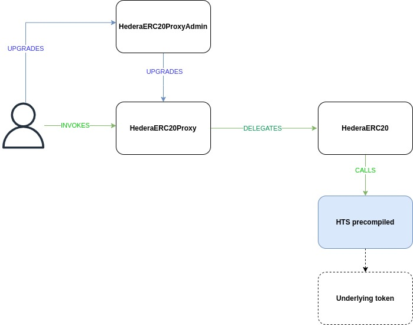

<div align="center">

# Hedera Stable Coin Smart Contracts

</div>

### Table of Contents
- **[Overview](#Overview)**<br>
- **[Architecture](#Architecture)**<br>
  - [Overall Architecture](#Overall-Architecture)<br>
  - [Detailed Architecture](#Detailed-Architecture)<br>
- **[Content](#Content)**<br>
- **[Technologies](#Technologies)**<br>
- **[Build](#Build)**<br>
- **[Test](#Test)**<br>
  - [Files](#Files)<br>
  - [Configuration](#Configuration)<br>
  - [Run](#Run)<br>
**[Deploy](#Deploy)**<br>
  - [Deploy Factory](#Deploy-Factory)<br>
  - [Create Stable Coins](#Create-Stable-Coins)<br>
**[Upgrade](#Test)**<br>
  - [Upgrade Factory](#Upgrade-Factory)<br>
  - [Ugrade Stable Coins](#Ugrade-Stable-Coins)<br>
- **[Documentation](#Documentation)**<br>
- **[Other Scripts](#Other-Scripts)**<br>

# Overview
This module contains the solidity smart contracts used in the Hedera stable coin project.

The Hedera Token Service (HTS) functionality required in this project is exposed through an `HTS precompiled smart contract` implemented, deployed and managed by Hedera.

The smart contracts located in the `hts-precompile` folder are used to interact with the *HTS precompiled smart contract* mentioned above, and have also been implemented and provided by Hedera. For more information about these contracts check the [Hedera Service Solidity Library](https://docs.hedera.com/guides/docs/sdks/smart-contracts/hedera-service-solidity-libraries) and the [Hedera hts precompiled contracts github repository](https://github.com/hashgraph/hedera-smart-contracts/tree/main/contracts/hts-precompile):
 - `HederaRespondeCodes.sol`: Contains the list of response codes the *HTS precompiled smart contract* methods return.
 - `IHederaTokenService.sol`: Interface implemented by the *HTS precompiled smart contract*. In order to execute an HTS operation, our smart contracts will  need to instantiate this interface with the *HTS precompiled smart contract* address.

The remaining smart contracts have been implemented by IOBuilders for this project:


 - Contracts within the `extensions` folder: *one contract for each stable coin operation*.
   - `Burnable.sol`: abstract contract implementing the *burn* operation (burn tokens from the treasury account, decreases the total supply).
   - `CashIn.sol`: abstract contract implementing the *cash-in* operation (mint new tokens and assign them to an account, increases the total supply).
   - `Wipeable.sol`: abstract contract implementing the *wipe* operation (burn token from any account, decreases the total supply).
   - `Rescatbale.sol`: abstract contract implementing the *rescue* operation (transfer tokens from the treasury to another account).
   - `Supplieradmin.sol`: abstract contract implementing all the cashin role assignment and management (assigning/removing the role as well as setting, increasing and decreasing the cash-in limit).
   - `TokenOwner.sol`: abstract contract that stores the addresses of the *HTS precompiled smart contract* and the *underlying token* related to the stable coin. All the smart contracts mentioned above, inherit from this abstract contract.
 - `Roles.sol`: Contains the definition of the roles that can be assigned for every stable coin.
 - `HederaERC20.sol`: Main Stable coin contract. Contains all the stable coin related logic. Inherits all the contracts defined in the "extension" folder as well as the Role.sol contract.
 - `HederaERC20Proxy.sol`: Extends the OpenZeppelin transaparent proxy implemention. This proxy will delegate business method calls to a *HederaERC20* smart contract and will implement the upgradable logic.
 - `HederaERC20ProxyAdmin.sol`: Extends the OpenZeppelin proxy admin implementation. This proxy will be the admin of the HederaERC20Proxy, that way, users will be able to invoke the HederaERC20 functionality through the HederaERC20Proxy and upgrade the HederaERC20Proxy implementation through the HederaERC20ProxyAdmin.
 - `StableCoinFactory.sol`: Implements the flow to create a new stable coin. Every time a new stable coin is created, several smart contracts must be deployed and initialized and an underlying token must be created through the `HTS precompiled smart contract`. This multi-transaction process is encapsulated in this contract so that users can create new stable coins in a single transaction.
 - `StableCoinFactoryProxy.sol`: Extends the OpenZeppelin transaparent proxy implemention. This proxy will delegate business method calls to a *StableCoinFactory* smart contract and will implement the upgradable logic.
 - `StableCoinFactoryProxyAdmin.sol`: Extends the OpenZeppelin proxy admin implementation. This proxy will be the admin of the StableCoinFactoryProxy, that way, users will be able to invoke the StableCoinFactory functionality through the StableCoinFactoryProxy and upgrade the StableCoinFactoryProxy implementation through the StableCoinFactoryProxyAdmin.

 > Every stable coin is made of a **HederaERC20Proxy** contract , a **HederaERC20** contract and an **underlying token** managed through the *HTS precompiled smart contract*.

# Architecture
## Overall Architecture


## Detailed Architecture


# Content
These are the folders you can find in this project:

 - `contracts`: The folder with the solidity files. Inside this folder you can also find the *hts-precompile* and the *extensions* folders presented in the **[Overview](#Overview)** section.
 - `scripts`: Typescript files used to create new stable coins. These files are used when testing.
 - `test`: Typescript tests files.
 - `typechain-types`: The most important thing in this folder are contract factories which are used not only for testing, but also by any other project importing the stable coin solution. The content of this folder is autogenerated by `hardhat-abi-exporter` plugin whenever the user compiles the contracts.
 - `.solhint.json`: Solhint tool configuration file for linting solidity code.
 - `hardhat.config.ts`: hardhat configuration file.
 - `package.json`: Node project configuration file.
 - `prettier.config.js`: Several languages code formatter configuration file.
 - `README.md`
 - `slither.config.json`: Slither configuration file.
 - `slither.report.json`: Slither report file.
 - `tsconfig.json`: TypeScript configuration file.

# Technologies
The IDE we use in this project is **Hardhat**, in order to use it you must have:

- [node (version 16)](https://nodejs.org/en/about/)
- [npm](https://www.npmjs.com/)

The smart contract programming language is **Solidity** version 0.8.10 or higher.


# Build
First download and install the project dependencies :

1. Run `cd contracts`. This will change your current working directory to the `contracts` folder.
2. Run `npm install`. This will create and populate `node_modules`.

Then compile and build the contracts, you can choose one of the following options:

1. Run `npm run compile` to compile the contracts that were modified after the last compilation (This will NOT build the package, you need to run step 3)
2. Run `npm run compile:force` to compile all the contracts (even those that were not modified after the last compilation) and build the package (you can skip step 3).
3. run `npm run build` to build the package without compiling the contracts.

The last two commands will generate a `build` folder that contains a `typechain-types` folder. This folder contains the contracts wrappers that allows us to access contracts abi importing the wrappers as shown below:

```code
import { HederaERC20__factory } from 'hedera-stable-coin-contracts/typechain-types';
```

# Test
Each test has been designed to be self-contained following the *arrange, act, assert* pattern. Tests are completely independent of each other and as such should successfully run in any order.

## Files
Typescript test files can be foud in the `test` folder:

- `burnable.ts`: Tests the stable coin burn functionality.
- `pausable.ts`: Tests the stable coin pause functionality.
- `rescatable.ts`: Tests the stable coin rescue functionality.
- `supplieradmin.ts`: Tests the stable coin cashin functionality.
- `wipeable.ts`: Tests the stable coin wipe functionality.
- `HederaERC20.ts`: Tests the remainig HederaERC20 functionality.


## Configuration
You need to configure in the `hardhat.config.ts` file **two Hedera accounts** that will be used for testing.

These accounts must be existing valid accounts in the **Hedera network** you are using to test the smart contracts, they must also have a **positive balance large enough** to run all the contract deployments, invocations and token creations executed in the tests.

Accounts must be defined in this section:
> hedera -> networks -> **[network in which you want to run the tests]** -> accounts

For each account you must provide the following information:
- **account**: Account ID (0.0.XXXXXX)
- **private Key**: Private Key associated to the account (7647657eerr65....878)
- **public Key**: Public Key linked to the private key (c14er56...78)
- **isED25519Type**: *true/false* indicate whether the private/public key is ED25519 (true) or ECSDA (false)

Example for the Hedera testnet (*these are fake accounts/keys*):

```hardhat.config.ts
    testnet: {
        accounts: [
            // An array of predefined Externally Owned Accounts
            {
                account: "0.0.48513676",
                privateKey:"8830990f02fae1c3a843b8aaad0433a73ee47b08d56426a8e416d08727ea0609",
                publicKey:"c14dbe4c936181b7a2fe7faf086fd95bdc6900e2d16533e3e8ffd00cac1fe607",
                isED25519Type: true
            },
            {           
                account: "0.0.47786654",
                privateKey:"302e020100300506032b6baf04220420b7ca8f1a5453d5c03b0d8ba99d06306ed6c93ee64d7bf122c21b0981e2b0b679",
                publicKey:"302a300506032b657003210057056288u5d5a9cdaeb85687391dc7372707c464f9e7cb0efb386cf4244ebdf6",
                isED25519Type: true
            },
        ],
    }
```

## Run

There are several ways to run the tests using the commands defined in the `package.json` file (according to the configuration defined in `hardhat.config.ts`):

 - Run all the test files in the `defaultNetwork` network:
```shell
npm test
```
 - Run all the test files in a specific network (Hedera TestNet):
```shell
npm test:testnet
```

 - Run a single test file in the `defaultNetwork` network:
```shell
npm test:mintable
```

 - Run a single test file in a specific network (Hedera PreviewNet):
```shell
npm test:previewnet:mintable
```

# Deploy
The stable coin solution is made of two major components. 
- The Factory: Smart contracts encapsulating the complexity of the creation of new stable coins.
- The Stable Coin: Smart contracts that are deployed by the factory, exposing the functionalities and services of the stable coin solution and interacting with an underlying token.

In order to create stable coins, the Factory must be deployed first. Once deployed, creating stable coins will be as simple as invoking the "createStableCoin" method of the Factory.

## Deploy Factory
The Factory deployment process can be executed by running the _deployFactory.ts_ script *(it can be easily done from the CLI and/or UI of the project, for more information on that check their respective README.md)*. These are the two tasks the script will carry out:

1. Deploying the Factory:
   - Deploying the Factory **Logic** smart contract (*StableCoinFactory.sol*).
   - Deploying the Factory **Proxy** smart contract (*StableCoinFactoryProxy.sol*).
   - Deploying the Factory **Proxy Admin** smart contract (*StableCoinFactoryProxyAdmin.sol*).
   - Updating the Factory Proxy's admin (from the deploying account) to the Factory Proxy Admin.

2. Updating the scripts for creating stable coins and upgrading the factory's logic:
   - _createStableCoin.ts_ : Must contain the address of the Factory Proxy.
   - _upgradeFactoryLogic.ts_ : Must contain the address of the Factory Proxy Admin.

## Create Stable Coins
Once the Factory has been deployed and the scripts updated, creating stable coins is very simple, just invoking one single method of the Factory's Logic : "createStableCoin(...)". *(it can be easily done from the CLI and/or UI of the project, for more information on that check their respective README.md)*

These are the steps the creation method will perform when creating a new stable coin:
- Deploy Stable Coin Logic smart contract (*HederaERC20.sol*).
- Deploy Stable Coin Proxy smart contract (*HederaERC20Proxy.sol*).
- Deploy Stable Coin Proxy Admin smart contract (*HederaERC20ProxyAdmin.sol*).
- Updating the Stable Coin Proxy's admin (from the deploying account) to the Stable Coin Proxy Admin.
- Creating the underlying token.
- Initilaizing the Proxy.
- Associating the Token to the deploying account.

# Upgrade
In order to make all our smart contract's implementation upgradable, we are using the *Transparent Proxy* pattern combined with the *Proxy admin* pattern, both frmo OpenZeppelin, you can find more information about these two patterns [here](https://docs.openzeppelin.com/contracts/4.x/api/proxy#transparent_proxy).

The Factory's and the Stable Coins's logic can be upgraded at any time using the account that was used to either deploy it the first time (for the Factory)
 or create it (for the Stable Coins).


## Upgrade Factory
- Deploy the new Factory Logic contract
- Invoke the _upgradeAndCall_ method of the Factory Proxy Admin passing the previously deployed Factory Logic contract's address and any data required to initialize it. If you do not need to pass any initialization data, you can simply invoke the _upgrade_ method passing the previously deployed Factory Logic contract's address. **=> USE THE FACTORY PROXY ADMIN'S ADMIN ACCOUNT TO PERFORM THIS TASK. BY DEFAULT THAT ACCOUNT WILL BE THE ONE ORIGINALLY USED TO DEPLOY THE FACTORY.**

## Ugrade Stable Coins
> These steps must be performed individually for every single stable coin you wish to update, it is not possible to update all stable coins at once since the are completely independent frmo each other

- Deploy the new Stable Coin Logic contract
- Invoke the _upgradeAndCall_ method of the Stable Coin Proxy Admin passing the previously deployed Stable Coin Logic contract's address and any data required to initialize it. If you do not need to pass any initialization data, you can simply invoke the _upgrade_ method passing the previously deployed Stable coin Logic contract's address. **=> USE THE STABLE COIN PROXY ADMIN'S ADMIN ACCOUNT TO PERFORM THIS TASK. BY DEFAULT THAT ACCOUNT WILL BE THE ONE ORIGINALLY USED TO CREATE THE STBALE COIN.**


# Documentation

Documentation files of all contracts, in markdown format, can be generated using the following command:
```shell
npm run doc
```

Generated files will be stored in the `docs` folder.

# Other Scripts

in addition to the compilation, build, test and documentation scripts we have already talked about, there are other scripts configured in `package.json` file:

Checks the contracts size in KiB.
```shell
npm run size
```

Lints Solidity code.
```shell
npm run lint:sol
```

Lints TypeScript code.
```shell
npm run lint:ts
```

Launches slither security report.
```shell
npm run security
```
