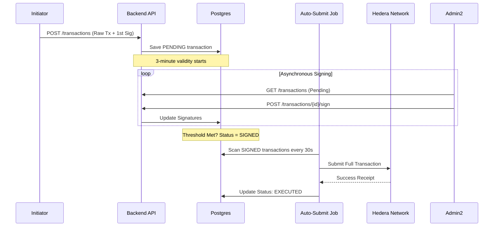
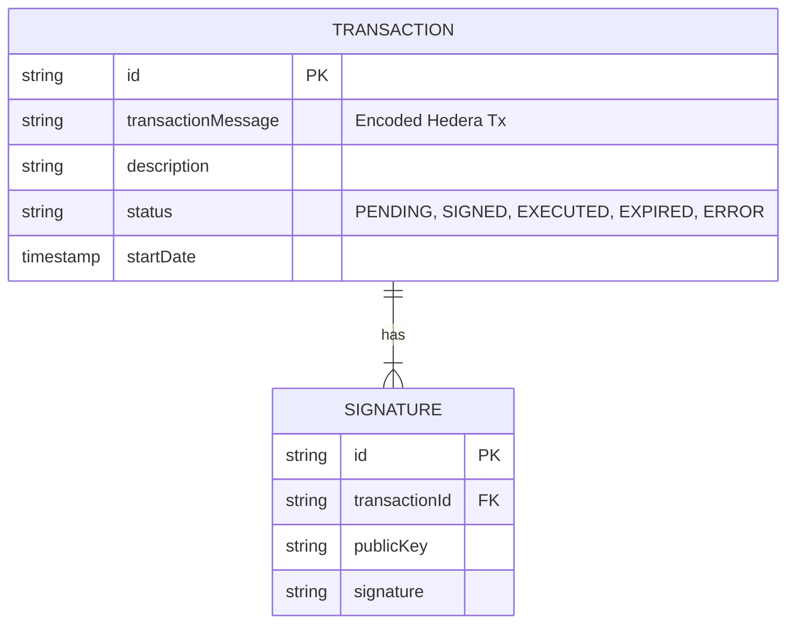

# 🏗️ Architecture & Internals

This section details the internal design of the Backend, intended for developers who need to extend the functionality or understand the data flow.

## 🛠 Tech Stack

* **Runtime**: Node.js (v18+)
* **Framework**: [NestJS](https://nestjs.com/) (TypeScript)
* **Database**: [PostgreSQL](https://www.postgresql.org/) 14+
* **ORM**: [TypeORM](https://typeorm.io/)
* **Hedera Integration**: [@hashgraph/sdk](https://github.com/hashgraph/hedera-sdk-js) 
* **Documentation**: [Swagger](https://swagger.io/) (OpenAPI 3.0)
* **Logging**: [Winston](https://github.com/winstonjs/winston)
* **Testing**: [Jest](https://jestjs.io/)

---

## 🧩 Modular Design

The application follows a Domain-Driven Design (DDD) approach via NestJS Modules:

| Module | Description |
| :--- | :--- |
| **TransactionModule** | **Core Logic**. Handles the creation, storage, signature collection, and submission of Multi-sig transactions. |
| **EventModule** | Listens to Smart Contract events emitted on the Hedera Network and syncs them to the local DB. |
| **ProxyModule** | Forwards read-only requests to Mirror Nodes, adding a layer of caching or security (optional). |
| **NetworkModule** | Manages the connection context (Testnet/Mainnet) and Client initialization. |

---

## 🔄 The Multi-Signature Flow

The most critical function of the backend is coordinating asynchronous signatures.

## 🕰️ The Auto-Submit Job (Scheduled Job)
The background worker (`AUTO_SUBMIT_JOB_FREQUENCY`) performs:
1.  **Auto-Submit**: Sends `SIGNED` transactions to Hedera.
2.  **Auto-Expire**: Marks transactions as `EXPIRED` if they aren't executed within **3 minutes** of `startDate`.

---

## 🗄️ Database Schema

The persistence layer uses a relational model to track the state of operations.

### Key Entities
1.  **Transaction**: Stores the *raw bytes* (`transactionMessage`) of the Hedera Transaction.
2.  **Signature**: Stores the cryptographic signature, public key, and relation to the Tx.

---

## 📡 Event Listener System

The backend includes a polling mechanism to catch events:
1.  **FactoryObserver**: Watches for new Stablecoins deployed.
2.  **TokenObserver**: Watches for `CashIn`, `Burn`, and `Transfer` events.