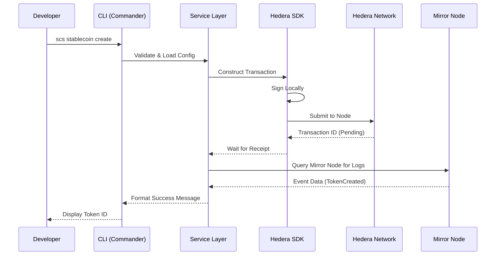

# 🏗️ Internal Architecture

## 🌊 Detailed CLI Flow
The Stable Coin Studio CLI is not just a wrapper; it manages a complex lifecycle for every transaction to guarantee consensus on Hedera.

### 1. Initialization & Context
When a command is typed, the `Entry Point` initializes the **Inversion of Control (IoC)** container. This loads:
- **Environment Variables**: Reads `.env` for the Operator Key.
- **Config Store**: Checks if a `config.yaml` or `config.json` exists to set the network context.

### 2. Command Parsing
Using `Commander.js`, the CLI validates:
- **Arguments**: Are the token name and symbol provided?
- **Flags**: Are decimals within the 0-18 range?
If validation fails, the process terminates here before spending any HBAR.

### 3. Logic Execution (Service Layer)
The request is passed to the **StableCoinService**. This layer:
1. **Resolves the Factory**: It calls the `FactoryResolver` to get the correct Contract ID.
2. **Encodes Parameters**: Converts the input into a format the EVM (Hedera Smart Contract Service) understands.
3. **Pre-checks**: Validates if the account has enough balance for the transaction fee.

### 4. Network Interaction (Hedera SDK)
- **Transaction Creation**: The SDK builds the `ContractExecuteTransaction`.
- **Signing**: The `TransactionSigner` uses the local private key. **Your key never leaves your machine.**
- **Submission**: The signed transaction is sent to a Hedera consensus node.

### 5. Post-Execution & Mirror Node
The CLI doesn't stop after sending the transaction. It enters a **Polling State**:
- It queries a **Mirror Node** to wait for the transaction to be "reached consensus".
- Once found, it parses the `TransactionReceipt`.
- **Output**: The CLI extracts logs to show you the new Token ID, Contract ID, and a link to HashScan.




## 🧪 Testing
The CLI includes a robust testing suite:
- **Unit**: Tests the `StableCoinService` logic with mocked network responses.
- **Integration**: Real end-to-end flows against the Hedera Testnet.
```bash
npm run test:unit
npm run test:integration
```