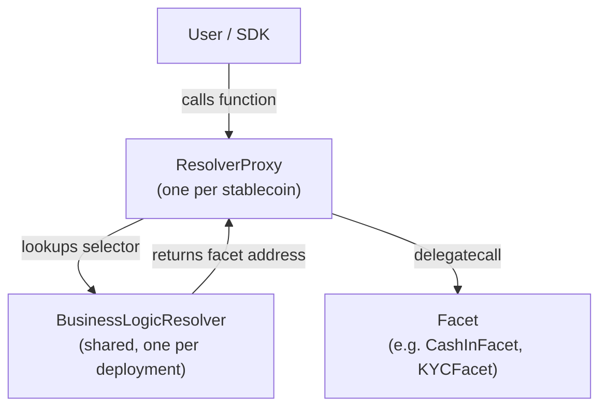

# Contract Architecture

Stablecoin Studio uses a **diamond proxy pattern with a centralized resolver** to achieve modular, upgradeable smart contract logic. This page explains how the pattern works and how the contracts are organized.

---

## Diamond Proxy Pattern

The diamond pattern (EIP-2535) allows a single contract address to delegate calls to multiple implementation contracts (facets). Stablecoin Studio adapts this pattern with a centralized resolver:



### How a Call Flows

1. A user (or the SDK) calls a function on the stablecoin's **ResolverProxy** address.
2. The proxy's fallback function extracts the function selector from the calldata.
3. The proxy queries the **BusinessLogicResolver** to find which facet implements that selector.
4. The proxy `delegatecall`s the facet, executing the logic in the proxy's storage context.
5. The result is returned to the caller.

### Why This Design

- **Centralized upgrades**: Updating the resolver changes the logic for all stablecoins at once.
- **Per-token opt-out**: A stablecoin can point to a different resolver to keep its current logic.
- **Modularity**: Each facet handles one domain (minting, KYC, freezing, etc.), making the codebase easier to audit and extend.
- **Version management**: The resolver tracks configuration keys and versions, enabling controlled rollouts and rollbacks.

---

## Contract Organization

```
contracts/
├── StableCoinFactoryFacet.sol       # Factory: deploys new stablecoins
├── HederaTokenManagerFacet.sol      # Core: init, ERC-20 reads, metadata
├── HederaReserveFacet.sol           # Reserve: Chainlink AggregatorV3
│
├── extensions/                      # Operation facets
│   ├── BurnableFacet.sol
│   ├── CashInFacet.sol
│   ├── CustomFeesFacet.sol
│   ├── DeletableFacet.sol
│   ├── FreezableFacet.sol
│   ├── HoldManagementFacet.sol
│   ├── KYCFacet.sol
│   ├── PausableFacet.sol
│   ├── RescuableFacet.sol
│   ├── ReserveFacet.sol
│   ├── RoleManagementFacet.sol
│   ├── RolesFacet.sol
│   ├── SupplierAdminFacet.sol
│   ├── TokenOwnerFacet.sol
│   ├── WipeableFacet.sol
│   └── Interfaces/                  # Facet interfaces
│
├── resolver/                        # Resolver infrastructure
│   ├── BusinessLogicResolver.sol
│   ├── BusinessLogicResolverWrapper.sol
│   ├── resolverProxy/
│   │   ├── ResolverProxy.sol
│   │   └── facets/                  # Diamond introspection facets
│   │       ├── DiamondCutFacet.sol
│   │       ├── DiamondLoupeFacet.sol
│   │       └── DiamondFacet.sol
│   └── diamondCutManager/
│       └── DiamondCutManager.sol
│
├── core/                            # Shared utilities
│   ├── Common.sol
│   ├── LibCommon.sol
│   ├── Initializable.sol
│   └── EnumerableSetBytes4.sol
│
├── constants/                       # Role definitions, storage slots, keys
│   ├── roles.sol
│   ├── resolverKeys.sol
│   └── storagePositions.sol
│
├── Interfaces/                      # Top-level interfaces
│   ├── IHederaTokenManager.sol
│   ├── IStableCoinFactory.sol
│   ├── IHederaReserve.sol
│   └── IHRC.sol
│
├── library/
│   └── KeysLib.sol
│
├── proxies/
│   └── Proxies.sol
│
└── migration/                       # Version migration helpers
    └── v2/
        └── MigrationProxy.sol
```

---

## Upgradeability

The BusinessLogicResolver enables centralized upgrades:

1. **Deploy new facets** with updated logic.
2. **Register them** in the resolver under the appropriate configuration key (e.g., `stableCoin`, `reserve`, `factory`).
3. All stablecoins using that resolver automatically pick up the new logic.
4. Rollback is possible by re-registering the previous facet addresses.

Configuration keys and versions allow the resolver to manage multiple parallel logic sets. For example, one version can be used for stablecoins while another is used for the factory.

---

## Storage Model

Each facet uses **unstructured storage** with fixed storage slots defined in `constants/storagePositions.sol`. This prevents storage collisions between facets sharing the same proxy storage context.

Storage wrapper contracts (e.g., `RolesStorageWrapper`, `HoldManagementStorageWrapper`) provide type-safe access to these storage slots.
