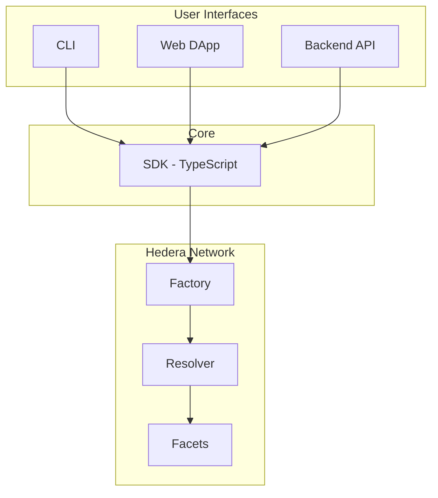

# Stablecoin Studio

Stablecoin Studio is an open-source toolkit that lets financial institutions issue, manage, and operate stablecoins on the **Hedera** network. It wraps every Hedera token with a programmable compliance layer so that issuers can enforce KYC, freeze accounts, control supply, and verify reserves — all without building infrastructure from scratch.

A stablecoin created with Stablecoin Studio is a **decorator** around a standard Hedera Token. The token itself lives on the Hedera Token Service (HTS) for speed and low fees, while a set of smart contracts adds the compliance and governance logic that regulated assets require.

---

## What You Can Do

| Capability | Description |
| --- | --- |
| **Issue stablecoins** | Deploy a fully configured stablecoin in a single transaction via the factory contract |
| **Control supply** | Mint (cash-in) and burn tokens with separated roles so no single actor controls the full lifecycle |
| **Enforce compliance** | Grant or revoke KYC, freeze individual accounts, wipe balances, and pause all transfers globally |
| **Prove reserves** | Link each stablecoin to a Chainlink-compatible data feed that attests the backing reserve |
| **Coordinate multisig** | Require multiple key holders to approve sensitive operations, with signatures collected through a backend API |
| **Upgrade logic** | Push new compliance rules to every stablecoin at once through the centralized resolver, or let individual tokens opt out |

---

## Components

Stablecoin Studio is composed of five modules that work together as a vertical stack. The smart contracts define the on-chain rules, the SDK provides programmatic access, and three interfaces (backend, CLI, web) expose those capabilities to different users.

### Smart Contracts

The on-chain foundation using a **diamond proxy pattern with a centralized resolver**. The Factory deploys stablecoins, the Resolver maps selectors to facets, and facets implement the domain logic.

[Smart Contracts documentation →](./contracts/overview.md)

### SDK

The **TypeScript SDK** follows hexagonal architecture with DDD and CQS. Commands change state, queries read state, and wallet adapters abstract the signing layer.

[SDK documentation →](./sdk/overview.md)

### Backend

A **NestJS REST API** for multisignature coordination. Optional — only needed for multi-key accounts.

[Backend documentation →](./backend/overview.md)

### CLI

A terminal interface supporting every SDK operation with an interactive wizard mode.

[CLI documentation →](./client/overview.md)

### Web DApp

A **React** application providing a visual interface for the complete stablecoin lifecycle.

[Web documentation →](./web/overview.md)

---

## How the Components Interact

1. **User action** — An administrator clicks "Mint 10,000 tokens" in the Web DApp (or runs the equivalent CLI command, or calls the SDK directly).
2. **SDK** — The SDK builds the appropriate command, selects the correct contract facet, and prepares a Hedera transaction.
3. **Signing** — If the account uses a single key, the wallet signs immediately. If it requires multiple keys, the transaction is sent to the backend, which collects all required signatures.
4. **Execution** — The signed transaction is submitted to the Hedera network. The resolver routes the call to the correct facet.
5. **Confirmation** — The SDK reads the transaction receipt and mirror node data to confirm the result.

---

## Roles

| Role | Permissions |
| --- | --- |
| **Admin** | Full management: update configuration, assign roles, upgrade logic |
| **Cash-in** | Mint new tokens into the treasury (with optional supply allowance limits) |
| **Burn** | Burn tokens from the treasury |
| **Wipe** | Burn tokens from any account (for compliance enforcement) |
| **Pause** | Pause and unpause all token transfers globally |
| **Freeze** | Freeze and unfreeze individual accounts |
| **KYC** | Grant and revoke KYC status for accounts |
| **Rescue** | Recover tokens and HBAR from the treasury |
| **Delete** | Permanently delete the underlying Hedera token (irreversible) |

---

## Getting Started

| Step | Action |
| --- | --- |
| 1 | [Overview](./gettingStarted/overview.md) — What Stablecoin Studio is and key concepts |
| 2 | [Quick Start](./gettingStarted/quick-start.md) — Prerequisites, install, and first stablecoin |
| 3 | [Usage](./gettingStarted/usage.md) — Roles, operations, and SDK/CLI reference |
| 4 | [Standards](./gettingStarted/standards.md) — HIPs, compliance, and OpenZeppelin mapping |

---

## References

- [Troubleshooting](/references/troubleshooting) — Common issues and solutions
- [Security policy](/references/security) — Vulnerability reporting
- [Hedera documentation](https://docs.hedera.com)
