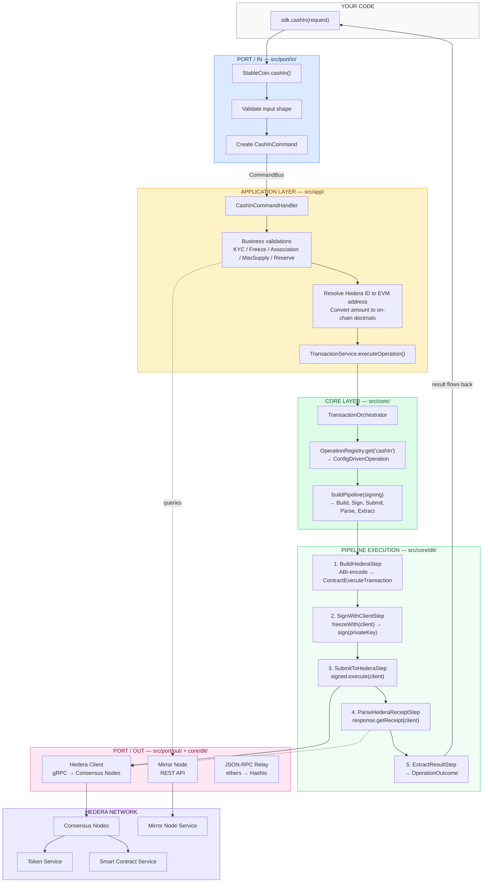
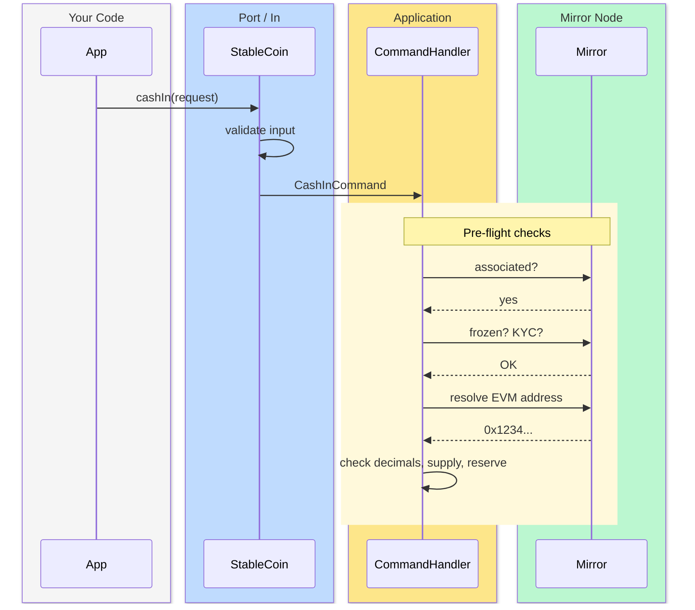
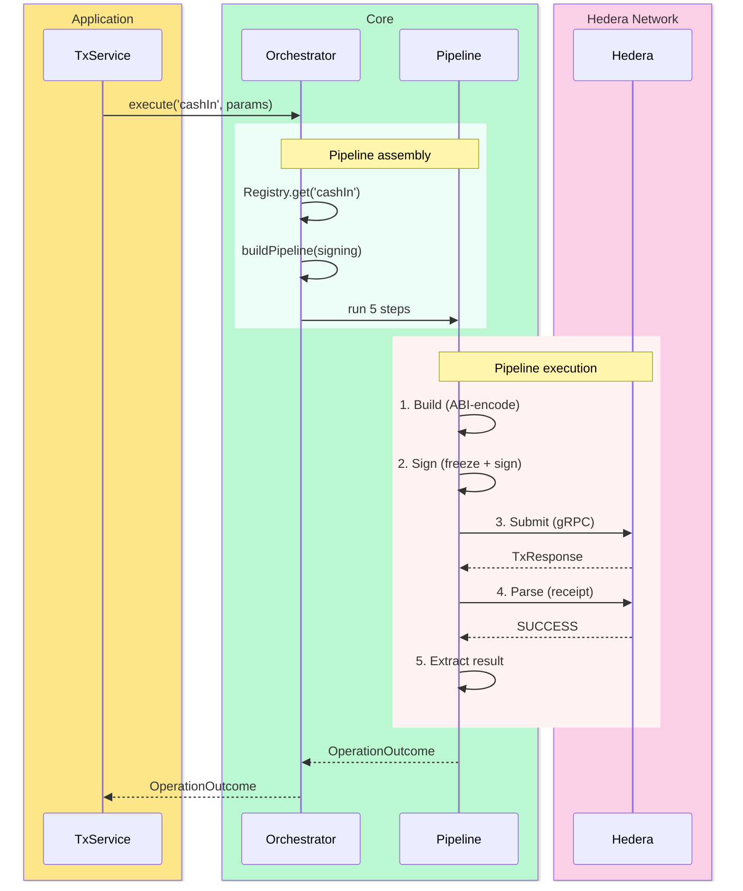
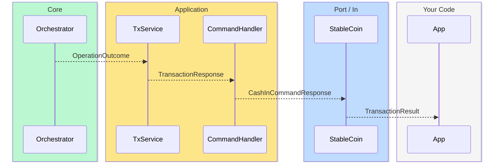
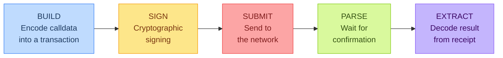

# Anatomy of an Operation

This page traces the complete journey of a single SDK call — from the **inbound port** where your code enters the SDK, through the **application layer** where business rules are enforced, into the **core layer** where the pipeline executes, and out through the **outbound ports** that interact with the Hedera network.

We use **cashIn** (minting tokens) as the example because it exercises every layer. The same architecture applies to all operations.

---

## The Big Picture

### Architecture by Layers



### Sequence Diagram — Port/In to Application



### Sequence Diagram — Core Pipeline Execution



### Sequence Diagram — Return Path



### Core Pipeline Flow

Every operation follows the same 5-phase pattern. The concrete step implementations change based on the signing mode, but the structure is always the same:



Each signing mode fills in different implementations for each phase:

| Signing Mode | Build | Sign | Submit | Parse | Extract |
| :--- | :---: | :---: | :---: | :---: | :---: |
| **Client** (Hedera native) | BuildHedera | SignWithClient | SubmitToHedera | ParseReceipt | ExtractResult |
| **Signer** (MetaMask / ethers) | BuildEVM | SignWithSigner | SubmitToRPC | ParseEVMReceipt | ExtractResult |
| **WalletConnect** (HashPack) | BuildHedera | SerializeHedera | SignAndExecuteExternal | _(atomic)_ | ExtractResult |
| **Custodial** (DFNS / Fireblocks) | BuildHedera | SignWithClient | SubmitToHedera | ParseReceipt | ExtractResult |
| **External / MultiSig** | BuildHedera | SerializeHedera | ReturnSerialized | _(caller handles)_ | _(caller handles)_ |

---

## The Call

```typescript
import StableCoin from '@hashgraph/stablecoin-npm-sdk';

const result = await StableCoin.cashIn(
  new CashInRequest({
    tokenId: '0.0.12345',
    targetId: '0.0.98765',
    amount: '1000',
  })
);
```

---

## Layer 1 — Port / In (Inbound Facade)

**File:** `src/port/in/StableCoin.ts`

The `StableCoin` class is the **public entry point** of the SDK. It is the inbound port — the only surface your application touches. Every method follows the same pattern:

```typescript
@LogError
async cashIn(request: CashInRequest): Promise<TransactionResult> {
    const { tokenId, amount, targetId, startDate } = request;
    handleValidation('CashInRequest', request);          // ① Input validation

    const response = await this.commandBus.execute(      // ② Dispatch command
        new CashInCommand(amount, HederaId.from(targetId), HederaId.from(tokenId), startDate),
    );

    return new TransactionResult(                         // ③ Map to public result
        response.payload, response.transactionId
    );
}
```

**What happens here:**

1. **Input validation** — The `CashInRequest` validates format constraints (amount is a valid number, tokenId and targetId are valid Hedera IDs, optional startDate is ISO format). If validation fails, the SDK throws before any network call.

2. **Command dispatch** — The validated input is wrapped in a `CashInCommand` domain object and dispatched via the `CommandBus`. This is the CQS pattern — commands change state, queries read state.

3. **Result mapping** — The internal `CommandResponse` is translated into the public `TransactionResult` that your application receives.

> The port/in layer **never** contains business logic. It validates input shape and delegates to the application layer.

---

## Layer 2 — Application Layer (Command Handler)

**File:** `src/app/usecase/command/stablecoin/operations/cashin/CashInCommandHandler.ts`

The `CommandBus` routes the `CashInCommand` to the registered `CashInCommandHandler`. This is where **business rules** live — the rules that are specific to the stablecoin domain, not to the underlying infrastructure.

```typescript
@CommandHandler(CashInCommand)
export class CashInCommandHandler implements ICommandHandler<CashInCommand> {
    constructor(
        public readonly stableCoinService: StableCoinService,
        public readonly accountService: AccountService,
        public readonly transactionService: TransactionService,
        public readonly queryAdapter: AbstractRPCQueryAdapter,
        public readonly mirrorNode: AbstractMirrorNodeAdapter,
    ) {}

    async execute(command: CashInCommand): Promise<CashInCommandResponse> {
        // ... business validation, then delegate to core
    }
}
```

### Step 2.1 — Pre-flight business validations

Before touching the blockchain, the handler performs a series of checks against the current on-chain state:

| Check | What it queries | Why |
| :--- | :--- | :--- |
| **Token association** | Mirror Node → account token relationships | Target must be associated with the token or have auto-association slots |
| **Freeze status** | Mirror Node → token relationship | Cannot mint to a frozen account |
| **KYC status** | Mirror Node → token relationship | Cannot mint to an account without KYC (if KYC is enabled) |
| **Decimal validation** | Token metadata (cached) | Amount cannot have more decimals than the token supports |
| **Max supply** | Contract query (RPC) | New total supply must not exceed max supply |
| **Reserve check** | Contract query (RPC) | If Proof of Reserve is enabled, new total supply must not exceed reserve |
| **Capabilities** | Contract + Mirror Node | Operator must have `CASHIN_ROLE` or be admin |

Any failed check throws a specific domain error (e.g., `AccountFreeze`, `AccountNotKyc`, `DecimalsOverRange`) **before** a transaction is built or gas is spent.

### Step 2.2 — Parameter enrichment

The handler resolves Hedera IDs to EVM addresses (via mirror node) and converts amounts from human-readable to on-chain representation:

```typescript
const targetEvmAddress = await this.mirrorNode.accountToEvmAddress(targetId);
const amountBd = BigDecimal.fromString(amount, coin.decimals);
```

### Step 2.3 — Delegate to core

Once all validations pass, the handler calls the `TransactionService` — the bridge between the application layer and the core:

```typescript
const res = await this.transactionService.executeOperation('cashIn', {
    contractAddress: coin.evmProxyAddress,
    targetId: targetEvmAddress,
    amount: amountBd.toLong().toString(),
});
```

> The application layer owns **what** to do (business rules). The core layer owns **how** to do it (transaction execution).

---

## Layer 3 — Core Layer (Transaction Orchestration & Pipeline)

### Step 3.1 — TransactionService creates the Orchestrator

**File:** `src/app/service/TransactionService.ts`

The `TransactionService` is the last piece of the application layer. It creates a `TransactionOrchestrator` configured with the current network and signing settings:

```typescript
private createOrchestrator(): TransactionOrchestrator {
    const network = networkService.environment;  // 'testnet' | 'mainnet' | custom endpoints
    const signing = this.toSigningConfig(this.getHandler());  // client | signer | external | custodial | multisig

    return new TransactionOrchestrator({ network, signing });
}
```

The `toSigningConfig()` method inspects the current wallet handler to determine the signing type. For example:
- `ClientTransactionAdapter` → `{ type: 'client', client, privateKey }`
- `HederaWalletConnectTransactionAdapter` → `{ type: 'hedera-external-execute', ... }`
- `CustodialTransactionAdapter` → `{ type: 'custodial', client, custodialSigner }`

### Step 3.2 — Orchestrator resolves the operation

**File:** `src/core/orchestration/TransactionOrchestrator.ts`

```typescript
const builder = this.operationRegistry.get('cashIn');
```

The `OperationRegistry` returns the `ConfigDrivenOperation` instance created from this declarative config:

```typescript
// src/core/operations/config/operations.ts
{
  name: 'cashIn',
  method: 'mint',                                      // Solidity function
  abi: 'function mint(address account, int64 amount)', // for ABI encoding
  gas: 200_000,
  args: [
    { param: 'targetId', type: 'address' },
    { param: 'amount',   type: 'int64'   },
  ],
  resultFields: ['targetId', 'amount'],
}
```

Note: `cashIn` in the SDK maps to `mint` in the smart contract. The config entry handles this translation transparently.

### Step 3.3 — Pipeline assembly

The orchestrator calls `buildPipeline(signing)`. The pipeline is determined entirely by the signing type:

**File:** `src/core/dlt/buildPipeline.ts`

```typescript
// For signing.type === 'client' (Hedera native with operator key):
[
  new BuildHederaStep(),
  new SignWithClientStep(client, privateKey),
  new SubmitToHederaStep(client),
  new ParseHederaReceiptStep(client),
  new ExtractResultStep(),
]
```

Other signing types produce different pipelines:

| Signing Type | Pipeline |
| :--- | :--- |
| `client` | Build → Sign → Submit → Parse → Extract |
| `signer` (MetaMask) | BuildEVM → SignWithSigner → SubmitToRPC → ParseEVM → Extract |
| `hedera-external-execute` (HashPack) | Build → Serialize → SignAndExecuteExternal → Extract |
| `hedera-external` | Build → Serialize → ReturnSerialized |
| `evm-external` | BuildEVM → SerializeEVM → ReturnSerialized |
| `custodial` (DFNS/Fireblocks) | Build → SignWithClient → Submit → Parse → Extract |
| `multisig` | Build → Serialize → ReturnSerialized |

### Step 3.4 — Pipeline execution (Hedera path)

The `PipelineExecutor` runs each step sequentially, passing an `ExecutionContext` that accumulates state:

#### BuildHederaStep

Calls `builder.buildHederaTransaction(params)` which:
1. Maps SDK params to Solidity args: `['0x12345...', 1000000000n]`
2. ABI-encodes: `ethers.Interface.encodeFunctionData('mint', args)` → `0x40c10f19...`
3. Wraps in a Hedera transaction:
   ```typescript
   new ContractExecuteTransaction()
     .setContractId(contractAddress)
     .setFunctionParameters(calldata)
     .setGas(200_000)
   ```

**Context gains:** `ctx.transaction` (unfrozen `ContractExecuteTransaction`)

#### SignWithClientStep

Freezes the transaction (assigns node IDs, valid start time) and signs with the operator's private key:

```typescript
const frozen = transaction.freezeWith(client);
const signed = await frozen.sign(privateKey);
```

> The private key never leaves the local machine.

**Context gains:** `ctx.signedTransaction`

#### SubmitToHederaStep (Port / Out)

This is the **outbound port** — the point where the SDK crosses the boundary to the Hedera network:

```typescript
const response = await signed.transaction.execute(client);
// → gRPC call to a Hedera consensus node
```

Typically takes 3-7 seconds for consensus.

**Context gains:** `ctx.response` (TransactionResponse with transactionId)

#### ParseHederaReceiptStep (Port / Out)

Waits for the consensus receipt:

```typescript
const receipt = await response.getReceipt(client);
// → polls until status is SUCCESS or throws on failure
```

**Context gains:** `ctx.receipt`

#### ExtractResultStep

Calls `builder.extractResult(receipt, params)` to build the final result:

```typescript
{
  success: true,
  transactionId: '0.0.12345@1711234567.000',
  targetId: '0x12345...',
  amount: '1000000000',
}
```

---

## Layer 4 — The Return Path

The result flows back through every layer:

```
ExtractResultStep → OperationOutcome
  → TransactionService.outcomeToResponse() → TransactionResponse
    → CashInCommandHandler → CashInCommandResponse
      → StableCoin.cashIn() → TransactionResult
        → Your code
```

Each layer translates the result into its own type:

| Layer | Type | Purpose |
| :--- | :--- | :--- |
| Core | `OperationOutcome` | Raw pipeline result with success flag and transaction ID |
| Application | `TransactionResponse` / `CashInCommandResponse` | Internal response with error handling |
| Port/In | `TransactionResult` | Public API result your application receives |

---

## Summary: Where each responsibility lives

```mermaid
graph TB
    subgraph PortIn ["PORT / IN — src/port/in/"]
        style PortIn fill:#dbeafe,stroke:#3b82f6,color:#1e3a5f
        PI1["Input validation<br/>(format, types, required fields)"]:::portIn
        PI2["Request → Command mapping<br/>(CashInRequest → CashInCommand)"]:::portIn
        PI3["Result → public DTO mapping<br/>(CommandResponse → TransactionResult)"]:::portIn
    end

    subgraph App ["APPLICATION LAYER — src/app/"]
        style App fill:#fef3c7,stroke:#f59e0b,color:#78350f
        A1["Business rule enforcement<br/>(KYC, freeze, supply cap, reserve)"]:::app
        A2["Parameter enrichment<br/>(Hedera ID → EVM address, decimals)"]:::app
        A3["Capability checks<br/>(role validation: CASHIN_ROLE, ADMIN)"]:::app
        A4["Signing config resolution<br/>(which wallet / adapter is active)"]:::app
    end

    subgraph Core ["CORE LAYER — src/core/"]
        style Core fill:#dcfce7,stroke:#22c55e,color:#14532d
        C1["Operation lookup<br/>(OperationRegistry, config-driven)"]:::core
        C2["ABI encoding<br/>(params → calldata via ethers)"]:::core
        C3["Pipeline assembly<br/>(signing type → step chain)"]:::core
        C4["Pipeline execution<br/>(Build → Sign → Submit → Parse → Extract)"]:::core
        C5["Error diagnostics<br/>(revert decoding, call traces)"]:::core
    end

    subgraph PortOut ["PORT / OUT — src/port/out/ + core/dlt/"]
        style PortOut fill:#fce7f3,stroke:#ec4899,color:#831843
        PO1["Hedera Client adapter<br/>(gRPC → consensus nodes)"]:::portOut
        PO2["Mirror Node adapter<br/>(REST → state queries)"]:::portOut
        PO3["JSON-RPC adapter<br/>(ethers → Hashio relay)"]:::portOut
        PO4["WalletConnect adapter<br/>(sign & execute via browser wallet)"]:::portOut
        PO5["Custodial adapter<br/>(Fireblocks, DFNS, AWS KMS)"]:::portOut
    end

    PortIn ==>|CommandBus| App
    App ==>|TransactionService| Core
    Core ==>|Pipeline steps| PortOut

    classDef portIn fill:#bfdbfe,stroke:#3b82f6,color:#1e3a5f
    classDef app fill:#fde68a,stroke:#f59e0b,color:#78350f
    classDef core fill:#bbf7d0,stroke:#22c55e,color:#14532d
    classDef portOut fill:#fbcfe8,stroke:#ec4899,color:#831843
```



---

## Adding a new operation

For **simple operations** (single contract call, no special business rules):

1. Add a config entry to `src/core/operations/config/operations.ts`
2. Add the command handler in `src/app/usecase/command/` with pre-flight validations
3. Add the public method to `src/port/in/StableCoin.ts`

The core pipeline, ABI encoding, signing, and submission are handled automatically.

For **complex operations** (struct parameters, multi-step workflows, custom encoding):
Extend `BaseContractOperation` directly — see `CreateStableCoinOperation`, `HoldOperations`, or `MultiRoleOperations` for examples.

---

## Error handling across layers

Errors are caught and enriched at each layer:

| Layer | What it catches | What it adds |
| :--- | :--- | :--- |
| **Port/In** | Validation errors | User-friendly messages, `@LogError` decorator |
| **Application** | Domain errors | Specific error types: `AccountFreeze`, `DecimalsOverRange`, `MaxSupplyReached` |
| **Core** | Pipeline errors | Revert reason decoding, contract error registry |
| **Core (opt-in)** | Tracing | Full call tree with contract names and decoded selectors |

When a transaction reverts on-chain, the `DiagnosticErrorHandler` queries the mirror node (Hedera path) or replays via `eth_call` (EVM path) to decode the revert reason. If tracing is configured, the `CallTraceAnalyzer` provides a full call tree showing exactly which internal call reverted and why.
