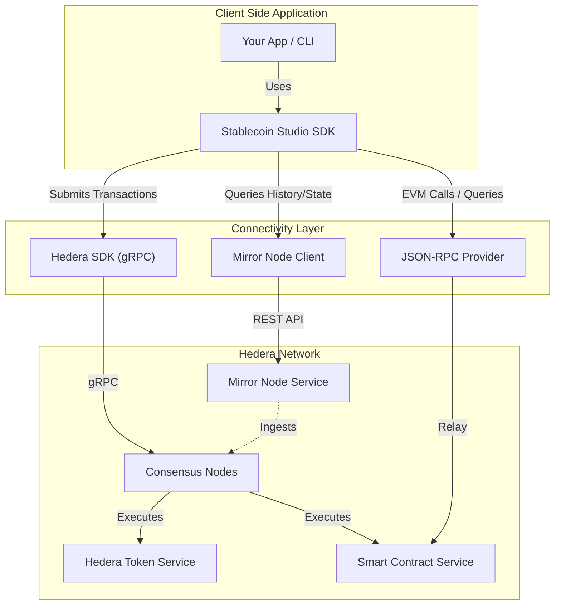

# 🏗️ SDK Architecture

The Stablecoin Studio SDK acts as a bridge between your application (CLI, DApp, Backend) and the Hedera Network. It utilizes a hybrid connectivity approach to ensure the best balance between performance (gRPC) and compatibility (RPC/EVM).

## 🗺️ System Overview

The following diagram illustrates how the SDK interacts with the Hedera Ecosystem using the **Hedera SDK**, **Mirror Nodes**, and **JSON-RPC Relays**.

## 🔌 Connectivity Components

### ⚡ 1. Hedera SDK (gRPC)
The **Direct Consensus Channel**. The Stablecoin SDK wraps the standard `@hashgraph/sdk` to submit transactions directly to consensus nodes via gRPC. 
* **Purpose:** High-throughput write operations.
* **Usage:** Token Creation, Minting, Burning, Wiping, Freezing.

### 🪞 2. Mirror Node (REST API)
The **Read-Only Layer**. Used for reading state and historical data without burdening the consensus nodes.
* **Purpose:** Data retrieval and event verification.
* **Usage:** Checking balances, verifying transaction inclusion, querying past events/logs.

### 💎 3. JSON-RPC (EVM Compatibility)
The **Web3 Bridge**. For interactions requiring Ethereum Virtual Machine (EVM) compatibility, the SDK leverages the JSON-RPC Relay.
* **Purpose:** Smart Contract views and standard Web3 tooling integration.
* **Usage:** Interacting with the Stablecoin Smart Contracts (HSCS) using standard Ethereum protocols.
