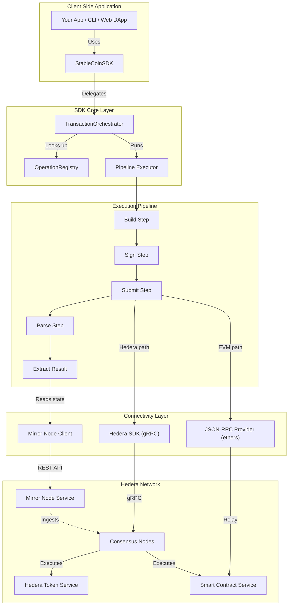

# SDK Architecture

The Stablecoin Studio SDK acts as a bridge between your application (CLI, DApp, Backend) and the Hedera Network. It follows a **hexagonal architecture** with DDD and CQS, built around a **pipeline-based execution engine** that supports multiple signing backends and two transport paths (Hedera native and EVM).

## System Overview

```mermaid
graph TD
    subgraph Client_Side ["Client Side Application"]
        App["Your App / CLI / Web DApp"]
        SDK["StableCoinSDK"]
    end

    subgraph Core_Layer ["SDK Core Layer"]
        Orchestrator["TransactionOrchestrator"]
        Registry["OperationRegistry"]
        Pipeline["Pipeline Executor"]
    end

    subgraph Steps ["Execution Pipeline"]
        Build["Build Step"]
        Sign["Sign Step"]
        Submit["Submit Step"]
        Parse["Parse Step"]
        Extract["Extract Result"]
    end

    subgraph Connectivity ["Connectivity Layer"]
        H_SDK["Hedera SDK (gRPC)"]
        RPC["JSON-RPC Provider (ethers)"]
        Mirror["Mirror Node Client"]
    end

    subgraph Hedera_Network ["Hedera Network"]
        Consensus["Consensus Nodes"]
        HTS["Hedera Token Service"]
        HSCS["Smart Contract Service"]
        MirrorNode["Mirror Node Service"]
    end

    App -->|Uses| SDK
    SDK -->|Delegates| Orchestrator
    Orchestrator -->|Looks up| Registry
    Orchestrator -->|Runs| Pipeline

    Pipeline --> Build --> Sign --> Submit --> Parse --> Extract

    Submit -->|Hedera path| H_SDK
    Submit -->|EVM path| RPC
    Extract -->|Reads state| Mirror

    H_SDK -->|gRPC| Consensus
    RPC -->|Relay| HSCS
    Consensus -->|Executes| HTS
    Consensus -->|Executes| HSCS
    Mirror -->|REST API| MirrorNode
    MirrorNode -.->|Ingests| Consensus
```

## Internal Architecture

### TransactionOrchestrator

The central execution engine. It receives an operation name and parameters, looks up the operation in the registry, builds the appropriate pipeline based on the signing configuration, and executes it.

### OperationRegistry

All operations (pause, cashIn, burn, freeze, grantRole, etc.) are registered declaratively via configuration objects. Each entry specifies the contract method, ABI, gas, parameter mapping, and result fields. Adding a new operation requires only a config entry — no new classes.

### Pipeline Executor

Transactions flow through a chain of **execution steps**. The pipeline is assembled at initialization based on the signing type:

| Step | Hedera Path | EVM Path |
| :--- | :--- | :--- |
| **Build** | `BuildHederaStep` — encodes calldata into `ContractExecuteTransaction` | `BuildEVMStep` — encodes calldata into an ethers `ContractTransaction` |
| **Sign** | `SignWithClientStep` — signs with the Hedera Client operator key | `SignWithSignerStep` — signs with an ethers Signer (or sends directly for browser wallets) |
| **Submit** | `SubmitToHederaStep` — sends to Hedera consensus nodes via gRPC | `SubmitToRPCStep` — broadcasts via JSON-RPC relay |
| **Parse** | `ParseHederaReceiptStep` — extracts receipt from consensus | `ParseEVMReceiptStep` — waits for transaction confirmation |
| **Extract** | `ExtractResultStep` — decodes return values and events from the receipt |

## Signing Modes

The SDK supports multiple signing backends through a unified pipeline:

| Signing Type | Transport | Description |
| :--- | :--- | :--- |
| `client` | Hedera gRPC | Direct signing with a Hedera Client (operator ID + private key) |
| `signer` | EVM JSON-RPC | Signing with an ethers Signer (private key or browser wallet like MetaMask) |
| `hedera-external` | Hedera | Serializes the transaction for external signing (returns raw bytes) |
| `hedera-external-execute` | Hedera | WalletConnect/HashPack sign and execute atomically |
| `evm-external` | EVM | Serializes EVM transaction for external signing |
| `custodial` | Hedera gRPC | Custodial providers (Fireblocks, DFNS, AWS KMS) via `CustodialSigner` callback |
| `multisig` | Hedera | Serializes for multi-signature coordination via the Backend API |

## Connectivity Components

### 1. Hedera SDK (gRPC)
The **Direct Consensus Channel**. Used by the Hedera pipeline path for native HTS operations.
* **Purpose:** High-throughput write operations.
* **Usage:** Token Creation, Minting, Burning, Wiping, Freezing, Role management.

### 2. Mirror Node (REST API)
The **Read-Only Layer**. Used for reading state, resolving EVM addresses, and verifying transaction results.
* **Purpose:** Data retrieval and event verification.
* **Usage:** Checking balances, resolving account addresses, querying past events/logs.

### 3. JSON-RPC (EVM Compatibility)
The **Web3 Bridge**. Used by the EVM pipeline path for browser wallet and ethers Signer interactions.
* **Purpose:** Smart Contract interaction via standard Ethereum protocols.
* **Usage:** MetaMask, WalletConnect, and any ethers-compatible Signer.

## Diagnostics (Optional)

When enabled, the SDK provides transaction diagnostics:
- **ContractErrorRegistry** — decodes revert reasons from known ABIs
- **CallTraceAnalyzer** — traces failed transactions for root-cause analysis
- **MirrorNodeDiagnostics** / **EVMDiagnostics** — network-specific error enrichment
