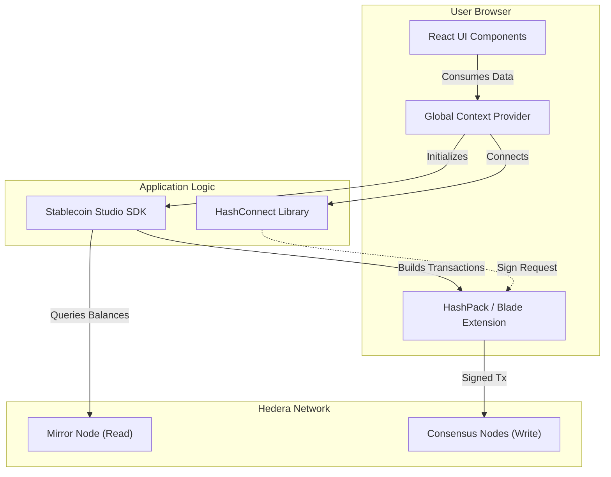

# Architecture

The Web UI acts as a client-side orchestrator. It does **not** store private keys. Instead, it delegates signing to the user's browser extension wallet (HashPack/Blade) and logic operations to the SDK.

---

## Project Structure

| Directory | Description |
| :--- | :--- |
| `src/components` | Reusable UI elements (Buttons, Modals, Tables) |
| `src/views` | Main page layouts (Dashboard, Treasury, Compliance) |
| `src/services` | Direct wrappers around the SDK methods |
| `src/hooks` | Custom React Hooks (e.g., `useStableCoin`, `useWallet`) |
| `src/contexts` | Global state providers (wallet connection, selected token) |
| `src/router` | Navigation logic (React Router) |

---

## Connection Flow

1. **Initialization**: On app load, the `WalletProvider` establishes a session with the HashConnect pairing string.
2. **SDK Injection**: Once connected, the app instantiates `StableCoinClient` with the wallet provider.
3. **Action Execution**: When a user clicks "Mint", the service calls `sdk.cashIn()`, which sends a sign request to the wallet extension. The user approves the popup, and the transaction is submitted to Hedera.

---

## Security

### Wallet Connection

* **Non-Custodial**: The Web UI **never** asks for or stores your Private Key or Seed Phrase.
* **Signatures**: All transactions must be explicitly approved via the Wallet Extension popup.

### Session Management

* The HashConnect pairing string is stored in LocalStorage to persist the connection on refresh.
* Clear your browser cache or disconnect via the wallet extension to end the session.

### Visual Security (RBAC)

The UI implements frontend guard rails:
* If your wallet lacks the `ADMIN_ROLE`, the "Settings" tab is hidden.
* If your wallet lacks the `CASHIN_ROLE`, the "Mint" button is disabled.

> Frontend checks are for UX only. The **real security** is enforced on-chain by the Smart Contracts. A user cannot bypass security by modifying the React code.
