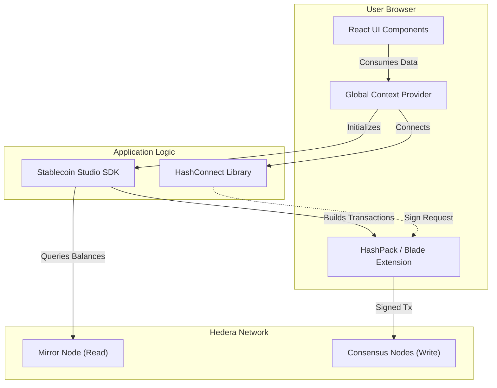

> **Web UI Documentation**
>
> [🚀 Getting Started](./quick-start.md) • [🏗️ Architecture & Stack](./architecture.md) • [🕹️ Usage & Workflows](./usage.md) • [⚙️ Configuration](./configuration.md) • [🛡️ Security](./security.md)
---

# 🏗️ Architecture & Tech Stack

This section describes how the Web Application is structured and how it interacts with the Hedera Network.

## 🧩 High-Level Architecture

The Web UI acts as a client-side orchestrator. It does **not** store private keys. Instead, it delegates signing operations to the user's browser extension wallet (HashPack/Blade) and logic operations to the SDK.

## 📂 Project Structure

The project follows a modular structure to separate UI components from blockchain logic.

| Directory | Description |
| :--- | :--- |
| `src/components` | Reusable UI elements (Buttons, Modals, Tables). |
| `src/views` | Main page layouts (Dashboard, Treasury, Compliance). |
| `src/services` | Direct wrappers around the SDK methods. |
| `src/hooks` | Custom React Hooks (e.g., `useStableCoin`, `useWallet`). |
| `src/contexts` | Global state providers (Wallet connection status, current selected token). |
| `src/router` | Navigation logic (React Router). |

## 🔌 Connection Flow

1.  **Initialization**: On app load, the `WalletProvider` attempts to establish a session with the HashConnect pairing string.
2.  **SDK Injection**: Once a wallet is connected, the app instantiates the `StableCoinClient` (from the SDK) injecting the provider from the wallet.
3.  **Action Execution**: When a user clicks "Mint":
    * The UI calls a service function.
    * The Service calls `sdk.cashIn()`.
    * The SDK constructs the transaction and sends it to the Wallet Extension.
    * The user approves the popup.
    * The transaction is submitted to Hedera.
