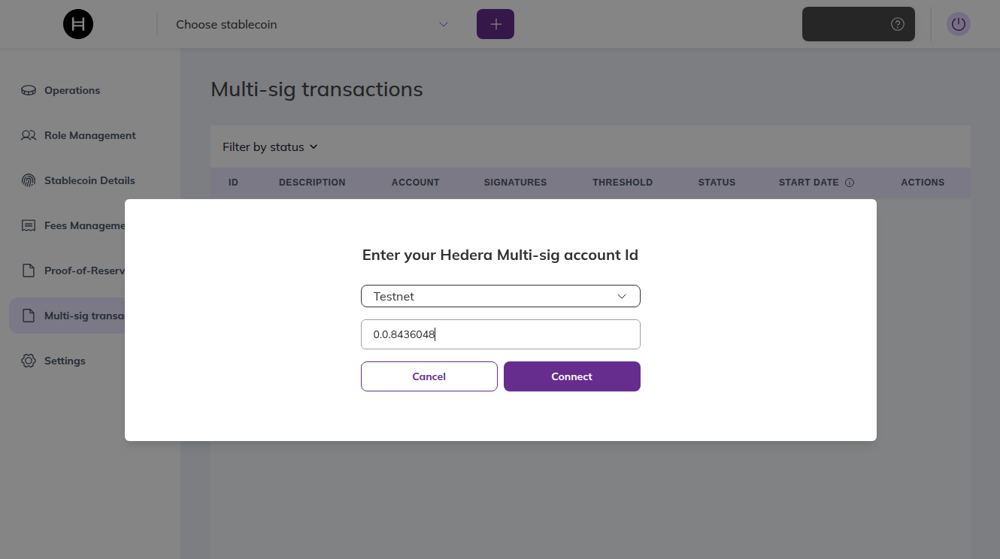
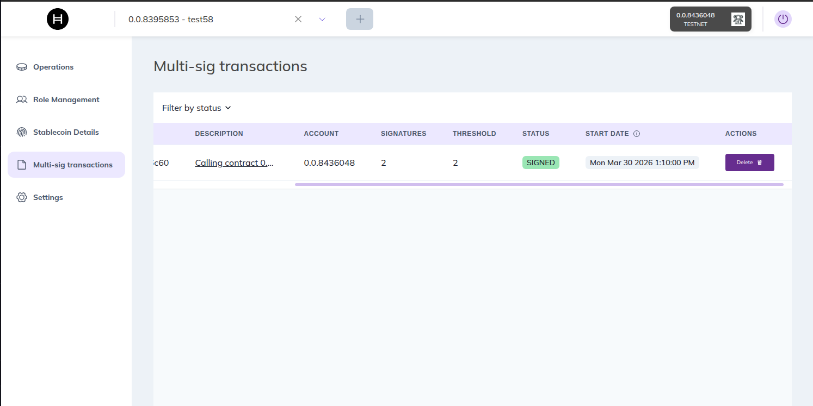

# Multisig Transactions

> **Important**: Before following this guide, make sure you have completed the full project setup. See the [Quick Start](../gettingStarted/quick-start.md) guide for installation and configuration instructions.

This guide walks you through executing a multi-signature transaction using the Web DApp. The example performs a freeze operation with a 2-of-2 multisig account, where both signers must approve before execution. We recommend using **HashPack** as the wallet.

> **Note**: Multisig requires a **native Hedera wallet**. We recommend **HashPack**, which you can connect via WalletConnect. MetaMask and other EVM-only wallets are not supported.

## Prerequisites

- The **full project setup** must be completed (see [Quick Start](../gettingStarted/quick-start.md)).
- A **multisig account** on Hedera with a key list (e.g., 2-of-2).
- A **token** associated to the multisig account.
- The multisig account must have **enough HBAR** to pay for transaction fees.

> **Don't have a multisig account yet?** Helper scripts are available in `packages/sdk/example/ts/multisig/` to quickly create a multisig account and associate a token for testing purposes. See the [Demo Setup](#demo-setup) section at the bottom of this guide.

---

## Step 1 — Start the Backend

The multisig feature depends on the backend service. Navigate to the `apps/backend` folder and bring it up:

1. Place the required `.env` file in the backend directory.
2. Start the services:

```bash
docker compose up -d --build
```

---

## Step 2 — Configure Permissions

1. Open the Web DApp.
2. Log in with one of the signer accounts using HashPack.
3. Select the token associated to the multisig account.
4. Assign a role to the multisig account. For this example, assign the **freeze** role.
5. Log out.

> **Note**: The multisig account must have the appropriate role for the operation you want to perform. In this example we use `freeze`, but you can assign any role (e.g., `cashin`, `burn`, etc.).

---

## Step 3 — Connect with the Multisig Account

1. In the connection modal, select **Multisig account**.
2. Choose the **network** and enter the **multisig account ID**. Click **Connect**.



3. Select the **stablecoin** you want to operate with from the dropdown at the top.

---

## Step 4 — Create a Multisig Transaction

1. Go to **Operations** and create a freeze transaction:
   - **Target account**: any account associated with the token.
   - **Execution time**: set a future timestamp (e.g., current time + 5 minutes). This is when the backend will submit the transaction to Hedera. All signatures must be collected before this time.
2. Confirm the transaction. It will appear with a `pending` status.

---

## Step 5 — Sign the Transaction

Each signer in the key list must approve the pending transaction individually:

1. Log in with the first signer account using HashPack.
2. In the sidebar, go to **Multi-sig transactions**.
3. Find the pending transaction and sign (approve) it.
4. Log out.
5. Log in with the next signer account using HashPack.
6. Repeat steps 2-3.

The transaction status will remain `pending` until all required signatures are collected.

---

## Step 6 — Execution and Verification

Once all signatures are collected, the transaction status changes to `SIGNED`. You can **Delete** it if you want to cancel it before the scheduled execution time.



When the scheduled execution time arrives, the transaction is automatically submitted to the Hedera network and the status will update to `executed`. Verify the operation took effect (e.g., the target account should now be frozen).

> **Warning**: If the multisig account does not have enough HBAR to cover transaction fees at execution time, the transaction will fail.

---

## Demo Setup (Testnet only)

The steps above describe how to use the multisig feature in the Web DApp. If you don't have a multisig account or an associated token yet, we provide a set of helper scripts in `packages/sdk/example/ts/multisig/` so you can quickly set up a testing environment on **testnet**.

> **Important**: These scripts are intended for **testnet only**. Do not use them with mainnet accounts or private keys.

You need **two Hedera accounts** with ECDSA private keys. If you don't have them, create them in the [Hedera Developer Portal](https://portal.hedera.com/).

### 1. Create a Multisig Account

This helper script creates a new Hedera account with a 2-of-2 KeyList, meaning both signer keys must approve every transaction made from this account.

Open `packages/sdk/example/ts/multisig/CreateMultisigAccount.ts` and edit the following variables:

- `ECDSA_1_PRIVATE_KEY` — ECDSA private key of the first signer account.
- `ECDSA_2_PRIVATE_KEY` — ECDSA private key of the second signer account.
- `FEE_PAYER` — The account that will pay the cost of creating the multisig account. It must have funds in the testnet.
  - `id` — Account ID (e.g., `0.0.12345`).
  - `privateKey` — ECDSA private key of the account.

```typescript
const ECDSA_1_PRIVATE_KEY = '';
const ECDSA_2_PRIVATE_KEY = '';

const FEE_PAYER = {
    id: '',
    privateKey: '',
};
```

From the `packages/sdk/example/ts` folder, run:

```bash
npm run execute:createMultisig
```

Save the resulting multisig account ID and send HBAR to it for transaction fees.

### 2. Associate a Token

This helper script associates an existing token to the multisig account. This is required before the multisig account can operate with that token.

Create a token using the CLI or Web DApp. Then open `packages/sdk/example/ts/multisig/AssociateToken.ts` and edit the following variables:

- `ECDSA_1_PRIVATE_KEY` — ECDSA private key of the first signer of the multisig account.
- `ECDSA_2_PRIVATE_KEY` — ECDSA private key of the second signer of the multisig account.
- `MULTISIG_ACCOUNT_ID` — The multisig account ID created in the previous step (e.g., `0.0.12345`).
- `TOKEN_ID` — The token ID to associate to the multisig account (e.g., `0.0.67890`).
- `FEE_PAYER` — The account that will pay the cost of the token association. It must have funds in the testnet.
  - `id` — Account ID (e.g., `0.0.12345`).
  - `privateKey` — ECDSA private key of the account.

```typescript
const ECDSA_1_PRIVATE_KEY = '';
const ECDSA_2_PRIVATE_KEY = '';

const MULTISIG_ACCOUNT_ID = '';

const TOKEN_ID = '';

const FEE_PAYER = {
    id: '',
    privateKey: '',
};
```

From the `packages/sdk/example/ts` folder, run:

```bash
npm run execute:associateToken
```

Once done, return to [Step 1](#step-1--start-the-backend) to continue with the guide.
