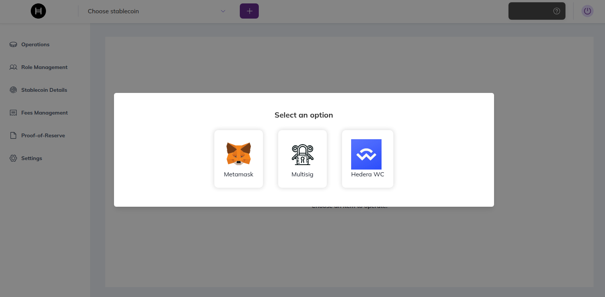

# Quick Start

## Prerequisites

* **Node.js** v18 or higher
* A **Hedera Wallet Extension** (HashPack or Blade) installed in your browser
* A **Hedera Testnet Account** (if running in dev mode)

---

## Installation

```bash
cd stablecoin-studio/web
npm install
```

---

## Configuration (.env)

Copy the example file and edit it **before starting the app**:

```bash
cp .env.example .env
```

| Variable | Description | Default / Example |
| :--- | :--- | :--- |
| `REACT_APP_NETWORK_TYPE` | Hedera network to connect to | `testnet` or `mainnet` |
| `REACT_APP_MIRROR_NODE_URL` | Custom Mirror Node URL (optional) | `https://testnet.mirrornode.hedera.com` |
| `REACT_APP_RPC_URL` | JSON-RPC Relay URL for EVM calls | *(Provider specific)* |
| `REACT_APP_FACTORY_ADDRESS` | Contract ID of the deployed Factory | `0.0.xxxxx` |

### Theme & Branding

* **Colors**: Defined in `tailwind.config.js` or main CSS variables
* **Logos**: Replace assets in `public/assets/images` to white-label the application

---

## Run

```bash
npm run start
```

Open [http://localhost:3000](http://localhost:3000) to view it in the browser.

---

## Connect Your Wallet

On first load, select your wallet provider to connect:



Supported options: **MetaMask**, **Multisig**, and **Hedera WalletConnect**.
