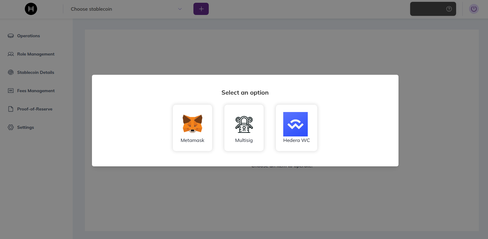

# Quick Start

## Prerequisites

* **Node.js** v18 or higher
* A **Hedera Wallet Extension** (HashPack or Blade) installed in your browser
* A **Hedera Testnet Account** (if running in dev mode)

---

## Installation

```bash
cd stablecoin-studio/apps/web
npm install
```

---

## Configuration (.env)

Copy the example file and edit it **before starting the app**:

```bash
cp .env.example .env
```

All values are JSON arrays so you can configure multiple environments.

### Required

| Variable | Description |
| :--- | :--- |
| `REACT_APP_FACTORIES` | Factory addresses per environment (see [Deployed Addresses](/references/deployed-addresses)). Format: `[{"Environment":"testnet","STABLE_COIN_FACTORY_ADDRESS":"0.0.xxxxx"}]` |
| `REACT_APP_RESOLVERS` | Resolver addresses per environment (see [Deployed Addresses](/references/deployed-addresses)). Format: `[{"Environment":"testnet","STABLE_COIN_RESOLVER_ADDRESS":"0.0.xxxxx"}]` |
| `REACT_APP_MIRROR_NODE` | Mirror node configuration (see [Hedera Mirror Nodes](https://docs.hedera.com/hedera/core-concepts/mirror-nodes)). If no API key is needed, leave `API_KEY` and `HEADER` empty. Format: `[{"Environment":"testnet","BASE_URL":"https://testnet.mirrornode.hedera.com","API_KEY":"","HEADER":""}]` |
| `REACT_APP_RPC_NODE` | RPC node configuration (see [Hedera JSON-RPC Relay](https://docs.hedera.com/hedera/core-concepts/smart-contracts/json-rpc-relay)). Same format as mirror node. |

### General

| Variable | Description | Default |
| :--- | :--- | :--- |
| `REACT_APP_LOG_LEVEL` | Log level: `ERROR`, `WARN`, `INFO`, `HTTP`, `VERBOSE`, `DEBUG`, `SILLY` | `ERROR` |
| `REACT_APP_SHOW_CONFIG` | Show configuration panel in the UI | `true` |
| `GENERATE_SOURCEMAP` | Generate source maps for debugging | `false` |

### Backend (optional, for Multi-Signature)

Only needed if you use multi-signature transaction support. See [Backend Quick Start](../backend/quick-start.md).

| Variable | Description |
| :--- | :--- |
| `REACT_APP_BACKEND_URL` | URL where the Backend service is running (e.g., `http://localhost:3001`) |

### Consensus Nodes

| Variable | Description |
| :--- | :--- |
| `REACT_APP_CONSENSUS_NODES` | Consensus node addresses (see [Hedera Nodes](https://docs.hedera.com/hedera/networks/mainnet/mainnet-nodes)). Format: `[{"Environment":"testnet","CONSENSUS_NODES":[{"ID":"0.0.3","ADDRESS":"34.94.106.61:50211"}]}]` |

### Hedera Wallet Connect (optional)

Required only if you want to connect wallets via [Hedera WalletConnect](https://walletconnect.com/). You need to create a project in the [WalletConnect Cloud](https://cloud.walletconnect.com/) to get a project ID.

| Variable | Description | Default |
| :--- | :--- | :--- |
| `REACT_APP_PROJECT_ID` | WalletConnect Cloud project ID | *(empty)* |
| `REACT_APP_DAPP_NAME` | Display name shown in the wallet pairing dialog | `Hedera Stablecoin` |
| `REACT_APP_DAPP_DESCRIPTION` | DApp description shown during wallet pairing | `StableCoin is a decentralized stablecoin platform built on Hedera Hashgraph.` |
| `REACT_APP_DAPP_URL` | DApp URL used for WalletConnect metadata | `https://wc.hgraph.app/` |
| `REACT_APP_DAPP_ICONS` | JSON array of icon URLs displayed in the wallet | *(Hedera logos)* |

### Theme & Branding

* **Colors**: Defined in `tailwind.config.js` or main CSS variables
* **Logos**: Replace assets in `public/assets/images` to white-label the application

---

## Run

```bash
npm run start
```

Open [http://localhost:3000](http://localhost:3000) to view it in the browser.

---

## Connect Your Wallet

On first load, select your wallet provider to connect:



Supported options: **MetaMask**, **Multisig**, and **Hedera WalletConnect**.
