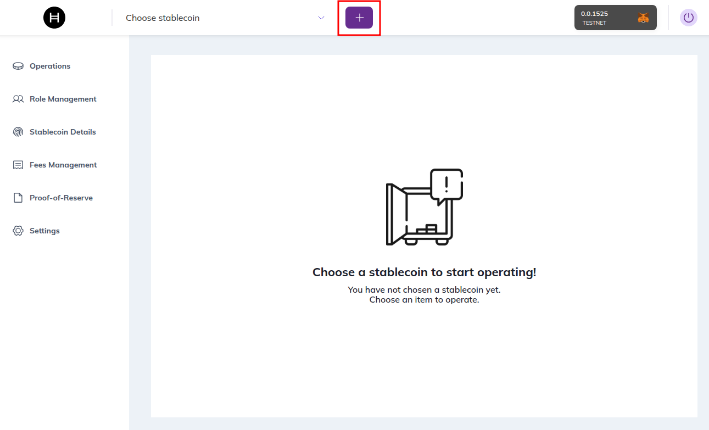
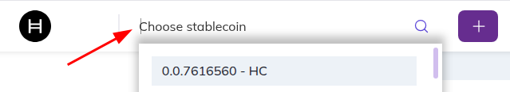
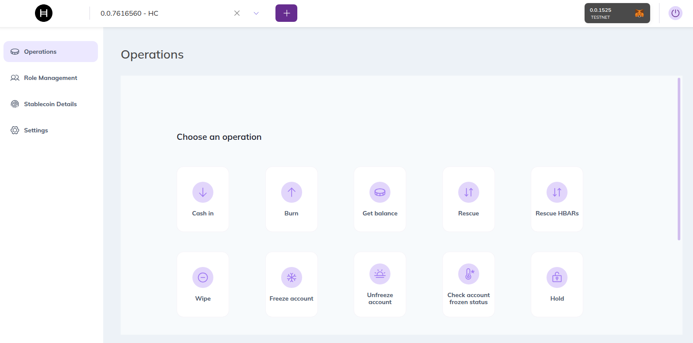

# Usage

The Web DApp covers the full stablecoin lifecycle: creation, treasury operations, compliance, and configuration.

---

## 1. Token Creation (The Wizard)

Click the **+** button in the top navigation bar to create a new stablecoin:

This launches a step-by-step wizard that abstracts the complexity of the Factory contract.

* **Step 1 — Token Details:** Define Name, Symbol, and Decimals. These are immutable after creation.
* **Step 2 — Supply Management:** Configure Initial Supply (minted immediately to treasury) and Max Supply (hard cap, optional).
* **Step 3 — Key Management:** Assign who holds each key role:
  * **Smart Contract** — the key is owned by the contract (trustless).
  * **Current Account** — you hold the key (centralized control).
  * **Other Account** — assign to a specific ID (e.g., a cold wallet or multisig).
* **Step 4 — Advanced Features:**
  * **Proof of Reserve** — link minting to an on-chain oracle feed.
  * **Grant KYC** — if enabled, accounts must be explicitly approved before holding tokens.
* **Result:** The DApp calls `sdk.createStableCoin()` and redirects to the token dashboard.

---

## Associating an Existing Stablecoin

To operate on an existing stablecoin, type its address directly in the **"Choose stablecoin"** dropdown at the top of the page:

The DApp will look up the token on Hedera and load it into your session.

---

## 2. Operations

Once you have your stablecoin created or imported, you can perform the available operations from the **Operations** tab:

| Operation | Description |
| :--- | :--- |
| **Cash In (Mint)** | Select a target address and amount. Increases total supply. If Proof of Reserve is enabled, the oracle feed is checked first. |
| **Burn** | Burn tokens from the treasury balance. Decreases total supply. |
| **Get Balance** | Check the token balance of any account. |
| **Rescue** | Recover HTS tokens accidentally sent to the stablecoin contract. Requires `RESCUE_ROLE`. |
| **Rescue HBARs** | Recover HBAR accidentally sent to the stablecoin contract. Requires `RESCUE_ROLE`. |
| **Wipe** | Forcefully remove tokens from a user's account. Requires `WIPE_ROLE`. |
| **Freeze / Unfreeze Account** | Block or restore an account's ability to transfer tokens. Requires `FREEZE_ROLE`. |
| **Check Account Frozen Status** | Verify whether a specific account is currently frozen. |
| **Hold** | Temporarily lock tokens under an escrow address for secondary market or compliance scenarios. |

### Danger Zone

At the bottom of the Operations tab you will find irreversible or high-impact actions:

| Operation | Description |
| :--- | :--- |
| **Pause Token** | Halts **all** transfers globally. Requires `PAUSE_ROLE`. Use for emergencies only. |
| **Unpause Token** | Resumes all transfers after a pause. Requires `PAUSE_ROLE`. |
| **Delete Token** | Permanently removes the token from the Hedera ledger. **Irreversible.** Requires `DELETE_ROLE`. |

---

## 3. Role Management

The **Role Management** tab lets you control who can perform each operation on your stablecoin.

| Action | Description |
| :--- | :--- |
| **View Roles** | See which accounts currently hold each role (Admin, Cash-in, Burn, Wipe, Freeze, KYC, Rescue, Delete). |
| **Grant Role** | Assign a role to a new account. Requires `DEFAULT_ADMIN_ROLE`. |
| **Revoke Role** | Remove a role from an account. Requires `DEFAULT_ADMIN_ROLE`. |
| **Edit Supplier Allowance** | For cash-in role holders, set, increase, or decrease their minting allowance. |

---

## 4. Stablecoin Details

The **Stablecoin Details** tab shows the token's on-chain metadata and current state:

- **Token Info**: Name, symbol, decimals, token ID, and proxy contract address.
- **Supply**: Current total supply and max supply cap.
- **Keys**: Which accounts or contracts hold each key (Admin, KYC, Freeze, Wipe, Supply, Fee, Pause, Delete).
- **Status**: Whether the token is paused or active.

---

## 5. Fees Management

The **Fees Management** tab allows administrators to configure custom fee schedules on the token.

### Fee Types

| Type | Description |
| :--- | :--- |
| **Fixed** | A flat amount charged per transfer. |
| **Fractional** | A percentage of the transferred amount, with configurable **min** and **max** bounds. |

### Fee Configuration

When adding a fee you configure:

- **Currency**: The fee can be charged in **HBAR** or in the **current stablecoin** itself.
- **Payer**: Choose whether the **sender** or the **receiver** pays the fee.
- **Collector Exempt**: When enabled, the fee collector account is exempt from being charged fees on its own transfers.
- **Min / Max** (fractional only): Set a minimum and maximum amount so the fee stays within a defined range.
- **Collector Account**: The account that receives the collected fee amounts.

You can also **view** all currently active fee schedules and **remove** existing fees.

---

## 6. Proof-of-Reserve

The **Proof-of-Reserve** tab manages the link between your stablecoin and its reserve data feed:

- **View Reserve**: Check the current reserve amount reported by the oracle.
- **Update Reserve** (demo mode): Manually set the reserve amount if using the demo reserve contract.
- **Change Feed Address**: Point the stablecoin to a different Chainlink-compatible AggregatorV3 data feed.

When Proof of Reserve is active, minting is blocked if the new total supply would exceed the reported reserve.

---

## 7. Settings

The **Settings** tab lets you update the stablecoin's proxy configuration:

- **Business Logic Resolver (BLR)**: Change the resolver address the stablecoin proxy points to.
- **Config Resolver ID**: Update the configuration key used to look up facets in the resolver.
- **Config Version**: Set the logic version the stablecoin should use.

---

## 8. Multi-Signature Mode

*Coming soon.*

---

## Permissions & Visibility

The UI adapts to your connected wallet's on-chain roles:

- If your wallet lacks `ADMIN_ROLE`, the "Settings" tab is hidden.
- If your wallet lacks `CASHIN_ROLE`, the "Mint" button is disabled.
- If your wallet lacks `FREEZE_ROLE`, the "Freeze" controls are not shown.

> These are UX guard rails only. The real security is enforced on-chain — the Hedera network rejects any unauthorized transaction regardless of what the frontend shows.
